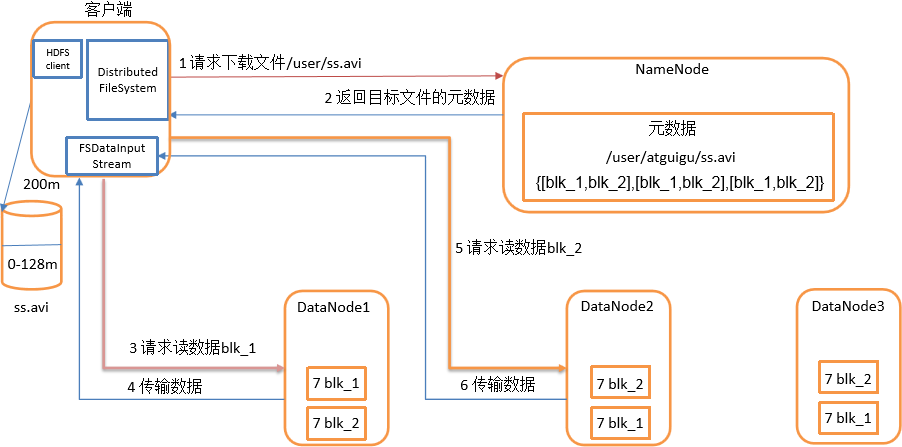

# 大数据处理相关框架对比
对比大数据场景中所使用到的开源框架，包括框架特性、模型、功能、性能、应用场景以及发展方向  
  
## 0. 前言  

* todo 大数据定义
* todo 大数据特征
* todo 大数据技术
* todo 大数据应用
* todo 大数据发展方向

在使用或学习大数据相关组件前，我们应该了解以下前置知识，包括开源许可证的种类与选择。

### 0.1 开源许可证
互联网环境下，无论是在企业中开发还是个人进行创作，只要遇到**开源软件**（小到远程控制工具OpenSSH，JAVA编程语言，大到Linux操作系统），都会见到**开源许可证**的影子，
此外，作者没有使用开源许可证的作品并不意味着该作品不受保护，恰恰相反，没有开源许可证的作品意味着用户仅能看源码而不能使用。
以下列举常见的7种开源许可证，基本覆盖日常应用
> 
> 图片来源于：阮一峰的网络日志

### 0.2 Hadoop版本
#### 0.2.1 Apache版本
#### 0.2.2 Cloudera版本（CDH）
#### 0.2.3 Hortonworks版本（HDP）

## 1. 文件系统
分析Hadoop Distributed File System（HDFS）与目前主流单机文件系统（以Linux为例）之间的关系对理解大数据相关框架所解决的问题具有重要意义。
### 1.1 HDFS
分布式文件系统是大数据处理的基石，而HDFS作为大数据领域中最常见的分布式文件系统，有着以下特性：
1. 高容错性，通过在集群的不同节点放置文件的多个副本来避免单点故障，以达到高容错性。
2. 高吞吐量，将文件分块存储，并利用多机并行处理，达到高吞吐量的文件读写操作。
3. 低成本，HDFS被设计成部署在低廉的硬件上，这些硬件通过网络进行互连，形成一个虚拟的整体，提供给用户统一的IO接口。
4. 可拓展性，在集群不重启的情况下，新节点只需要通过向NameNode注册添加DataNode即可完成集群的空间热扩容。
#### 1.1.1 存储模型
HDFS的结构是一种主/从模型，有一个主服务器（NameNode）负责该文件系统元数据（每个block占用元数据150字节）的管理以及相应用户的访问。同时，文件的具体数据按照固定大小的块被切分并存储到DataNode上，用户对文件的读写将被DataNode实际处理。
> 
> 图片来源于：Hadoop官网
#### 1.1.2 心跳机制
DataNode定期给NameNode发送心跳信息，NameNode接受到来自DataNode的心跳信息或者长时间未接收到心跳信息都会进行处理：
* **心跳信息处理**  
  + 判断自身DataNode是否注册，否则在NameNode注册（动态添加）
  + 更新DataNode的负载信息（更新集群信息）
  + NameNode生成IO指令，返回给DataNode（响应用户读写操作或系统更新操作）
* **心跳检查**（长时间未收到心跳信息）
  + 超时时长公式 `timeout = 2 * heartbeat.recheck.interval + 10 * dfs.heartbeat.interval`，其中，默认的heartbeat.recheck.interval 大小为5分钟，dfs.heartbeat.interval默认为3秒。
  + 当超过该阈值时长时，DataNode仍然没有发送心跳信息到NameNode，NameNode就会标记该DataNode死亡。
#### 1.1.3 HDFS副本存放机制（四大机制）
  * 第一个副本，如果写请求方式是集群中的一个DataNode，直接存放在该节点上，否则在集群中随机选择一个DataNode
  * 第二个副本，存放于不同于第一个副本所在的机架的DataNode上
  * 第三个副本，存放于第二个副本所在机架的不同节点上
  * 如果多余三个副本，随机存放在集群中的各个节点上
#### 1.1.4 启动过程
HDFS的启动过程分为四个阶段：
* 第一阶段：NameNode 读取包含元数据信息的FSImage文件，并加载到内存；
* 第二阶段：NameNode读取体现HDFS最新状态的EditLog日志文件，并加载到内存中
* 第三阶段：生成检查点，SecondaryNameNode将EditLog日志中的信息合并到FSImage文件中
* 第四阶段：进入安全模式，检查数据块的完整性
#### 1.1.5 检查点机制（四大机制）
> 
> 图片来源Github
#### 1.1.6 安全模式（四大机制）
NameNode在启动或客户端设置，会进入安全模式。安全模式用于恢复元数据，即合并FSImage以及EditLog，接受DataNode的心跳信息，构建文件系统抽象目录树关系以及数据块与数据节点之间的关系  
NameNode在安全模式下，有以下特点：
1. 不修改系统的命名空间
2. 不删除或复制块  
#### 1.1.7 负载均衡（四大机制）
在集群空闲时进行负载均衡，进行负载均衡的带宽默认1M
#### 1.1.8 高可用High Available(HA)
HA的目标是消除单点故障。通过部署多个NameNode进行主备切换来消除单点故障，其中只有一个Active NameNode可以进行EditLog的写，其余Standby NameNode只可以进行读（官网上提供两种实现方式：Journal Node 以及 Network File System(NFS)）。故障转移流程如下图所示：
> 
> 图片来源CSDN  

其中，为了防止脑裂（由于网络原因，出现多个自认为是Master的节点），ZK提供了预防脑裂的方法，隔离（fencing）：
1. 直接ssh到失效NameNode kill掉程序
2. 执行自定义脚本
3. 同一时间，只允许一个NameNode向Journal Node写数据，只允许一个NameNode响应客户端的请求，只允许一个NameNode向DataNode发指令
#### 1.1.9 HDFS联邦机制
HDFS的1.x版本采用一个NameNode管理命名空间以及数据块信息。这样做的缺点有：
1. 命名空间跟数据块信息高度耦合
2. NameNode拓展性受限
3. 系统性能（吞吐量）受限于NameNode
4. 不能保障数据的隔离性
5. 存在单点故障问题

HDFS的2.x版本采用联邦机制，引入块池（block pool）以及命名空间卷（namespace volumn），每个block pool存储于DataNode上，一个NameSpace以及对应的block pool被称为namespace volume，是升级的基本单位，如图所示：
>   
> 图片来源HDFS官网

联邦机制的优点：
1. 支持NameNode水平拓展，支持命名空间卷隔离
2. 多个NameNode提高吞吐量
3. 高可用性（解决单点故障）
#### 1.1.10 HDFS读写数据流程
> 读文件流程：
> 
> 写文件流程：
>   
> 图片来源Github
#### 1.1.11 HDFS支持的操作
| 用户命令 | 管理命令 | 
| :-----: | :-----: |
| classpath fetchdt fsck getconf groups lsSnapshottableDir jmxget oev oiv oiv_legacy snapshotDiff version **appendToFile cat checksum chgrp chmod chown copyFromLocal copyToLocal count cp createSnapshot deleteSnapshot df du dus expunge find get getfacl getfattr getmerge help ls lsr mkdir moveFromLocal moveToLocal mv put renameSnapshot rm rmdir rmr setfacl setfattr setrep stat tail test text touchz truncate** | balancer cacheadmin crypto datanode dfsadmin dfsrouter dfsrouteradmin haadmin journalnode mover namenode nfs3 portmap secondarynamenode storagepolicies zkfc |
#### 1.1.11 接口与具体实现
> tood 详情，参考[HDFS 接口与具体实现](./HDFS/main.md)

* todo 应用场景
* todo 发展方向
### 1.2 Linux文件系统
在Unix/Linux系统中有一个重要的概念：一切皆文件。因此，Linux的文件系统管理着所有所能管理的东西。
#### 1.2.1 文件系统层次
当用户程序需要调用IO接口时，将会由Glibc库转化为系统调用（SCI层），并由虚拟文件系统抽象出具体文件系统的实现，最终转化为设备驱动指令，达到读写文件或设备的目的。
>  图片来源于：ChinaUnix博客  

其中，了解Linux文件系统的抽象——虚拟文件系统（Virtual File System，VFS），有助于从宏观的角度认识Linux文件系统。
#### 1.2.2 统一文件模型
针对不同文件类型**普通文件，目录，设备，套接字**），Linux为它们提供了统一的操作接口，即VFS标准接口。定义标准接口需要预先定义标准对象，VFS提出统一文件模型来定义四种对象，这些对象将作为VFS标准接口的基础。
* superblock：存储文件系统基本的元数据。（支持挂载多个文件系统，因此superblock是一条链表，记录所有挂载的文件系统信息，包括根目录信息、支持的操作、状态以及容量大小等）
* index node（iNode）：保存一个文件相关的元数据。包括文件的所有者（用户、组）、访问时间、文件类型等，但不包括这个文件的名称。文件和目录均有具体的inode对应，一个block在ext3占用128字节，ext4和xfs占用256字节。
* directory entry（Dentry）：保存了文件（目录）名称和具体的inode的对应关系，用来粘合二者，同时可以实现目录与其包含的文件之间的映射关系。另外也作为缓存的对象，缓存最近最常访问的文件或目录，提示系统性能
* file：一组逻辑上相关联的数据，被一个进程打开并关联使用（由多个block实际存储数据默认占用4k字节，硬盘物理扇区512字节）
四者的关系如图所示：
>    
> 图片来源CSDN
#### 1.2.3  VFS所支持的系统调用
| 文件系统相关 | 目录相关 | 链接相关 | 文件相关 |
| :-----: | :----: | :----: | :----: |
| mount, umount, umount2, sysfs,  statfs,  fstatfs,  fstatfs64, ustat | chroot，pivot_root，chdir，fchdir，getcwd，mkdir，rmdir，getdents，getdents64，readdir，link，unlink，rename，lookup_dcookie  | readlink，symlink | chown， fchown，lchown，chown16，fchown16，lchown16，hmod，fchmod，utime，stat，fstat，lstat，acess，oldstat，oldfstat，oldlstat，stat64，lstat64，lstat64，open，close，creat，umask，dup，dup2，fcntl， fcntl64，select，poll，truncate，ftruncate，truncate64，ftruncate64，lseek，llseek，read，write，readv，writev，sendfile，sendfile64，readahead |

* todo 应用场景
* todo 发展方向
### 1.3 HDFS与Linux文件系统的关系
* HDFS的实现基于Linux文件系统
* HDFS考虑分布式环境，Linux文件系统不考虑分布式环境
* 两者设计目标不同，不构成竞争
* HDFS不支持链接，VFS支持软、硬链接
* Linux的文件包含普通文件、目录、设备以及Socket，HDFS的文件仅对应文件数据
* HDFS的一个数据块（Block）存储在多个节点，VFS的一个Block存储在一个设备

## 2. 资源管理与调度监控系统
目前主流的资源管理与调度监控系统包括YARN、Mesos（Apache）、Borg以及Kubernetes（Google）。他们的共同目标都是对集群的资源进行统一管理以及对运行在集群上的任务进行调度与监控，提高集群的资源利用率，降低管理成本。
### 2.1 YARN
YARN是一种资源管理与调度监控系统，由MapReduce version 1演变而来。
#### 2.1.1 MapReduce version 1（MRv1）
在MRv1中有两类角色：JobTracker和TaskTracker，JobTracker负责资源的管理以及任务的调度，TaskTracker负责任务的执行并返回信息给JobTracker，如图所示：
>   
> 图片来源Hadoop官网

这样的结构会产生以下问题：
1. 可拓展差，由于JobTracker同时负责资源的管理以及任务的调度，在管理节点较多以及执行任务较多的情况下，JobTracker容易成为系统性能瓶颈
2. 可用性低，采用Master/Slave架构，但实际上Master有且只有一个，当Master发送故障时，系统无法提供服务
3. 利用率低，MRv1采用静态资源配置，每个TaskTracker将可用资源划分成Map Slot以及Reduce Slot，两者不可资源共享，导致资源利用率低下
4. 不支持多种计算框架，仅支持MapReduce离线计算，不支持内存计算框架，也不支持流式计算框架

由于以上限制，MRv1仅支持4000左右个节点。
为了解决上述种种限制，Apache对MRv1进行优化，提出了MapReduce Version 2（MRv2），其中YARN便是MRv2中的核心内容。
#### 2.1.2 YARN系统结构 
如图所示，YARN中有三种节点：ResourceManager（RM）、NodeManager（NM）以及MRAppMaster（APPMaster）。其中RM负责资源的管理、APPMaster负责任务的调度与监控、NM负责Map/Reduce任务的实际执行
>   
> 图片来源于Hadoop官网

通信方式：YARN与Mesos均采用心跳机制进行通信以及信息更新。
#### 2.1.3 资源调度器
由于集群资源有限，在多用户、多任务环境下，需要一个资源调度器针对有限的资源进行任务的有序调度。默认实现为容量调度器（Capacity Scheduler）。
1. FIFO调度器
先进先出，为先来的应用分配资源，满足第一个后依次为下一个提供服务。不适合集群
2. 容量调度器（默认）
允许多个组织共享整个集群。每个组织有专门的队列（FIFO）以及整个集群中一部分的计算能力，同时提出弹性队列概念，即某个队列由于任务太多而导致资源不够用时，容量调度器会将空闲队列的资源分配给繁忙队列的任务，但容量调度器不会强制要求其他队列释放资源
3. 公平调度器
每个用户在启动任务时同时产生一个任务队列，各个任务队列共享集群资源（均分），每个队列内部在按照内存公平共享或FIFO共享资源
#### 2.1.4 资源隔离机制
YARN中的Container是封装了一定量CPU和内存资源的JAVA对象。
1. 内存隔离机制 采用额外的监控进程，监控Container的内存使用情况，当超过约定的内存资源量时（考虑了JVM创建子进程内存翻倍的情况），就会被杀死
2. CPU隔离机制 考虑到不同节点的CPU性能不同，提出虚拟CPU概念，更强计算能力设置更多的虚拟CPU。最终采用Linux所提供的Cgroups进行限制，内存不能用Cgroups限制是因为JVM创建子进程时内存会翻倍出现抖动情况
#### 2.1.5 负载不均衡问题
节点任务负载不均衡现象：通过心跳机制领取任务，优先发送心跳的会领取更多的任务。
为避免上述情况，如果采用公平调度器将yarn.scheduler.fair.max.assign设置为1（默认是-1），如果容量调度器则不能配置。
但是，一般而言，任务数量远大于节点数量，集群的所有节点都会处于忙碌状态。
#### 2.1.6 高可用以及任务恢复
YARN提供了恢复机制，这使得YARN在服务出现故障和人工重启时，不会对正在运行的应用程序产生任何影响（高可用）。YARN的高可用包括以下三个部分：RM HA、RM重启以及NM重启。
1. RM HA：采用Active/Standy RM以及ZK主备切换解决单点故障问题，并通过RM重启（第二点）恢复服务
2. RM重启：RM在运行过程中会将状态存储在ZK中，当发送重启或者故障时，新启动的RM在ZK中重新读取信息，重启后各个NM向其进行注册，返回所管理的容器信息，APPMaster也会重新发送资源请求
3. 当NM就地重启时，原有运行的Container不会被杀死，而是等新的NM接管并继续运行
* todo 应用场景
* todo 发展方向
### 2.2 Mesos
Mesos同样是Apache的基于Master/Slave架构的资源管理框架，不过Mesos不负责任务的调度以及监控，Mesos最多支持六万个左右节点。
#### 2.2.1 Mesos系统结构
Mesos的组成包括Master、Slave、Framework Scheduler以及Framework executor等角色。如图所示：
> 
> 图片来源Mesos官网

其中，Master管理集群中所有Slave的资源，Framework向Master申请资源并将所得到的资源按Framework Scheduler分配策略执行。如图所示：
> 
> 图片来源Mesos官网

#### 2.2.2 资源调度器
Mesos的资源调度器采用Dominant Resource Fairness（DRF）算法，该论文是一种针对不同资源类型的max-min fairness算法，核心思想：最大化所有用户中最小的Dominant share，其中，用户的Dominant share是用户最需要资源在集群中所占的份额（如，CPU密集型任务的Dominant share为所分配的CPU占集群总CPU的百分比）。
> 详情参考论文Dominant Resource Fairness: Fair Allocation of Multiple Resource Types

Mesos支持粗粒度与细粒度资源调度。其中粗粒度指的是，获得资源后就长期持有，直至程序退出才释放资源，细粒度指的是，根据实际需要动态申请资源，任务完成后就释放资源。Mesos在各个Framework之间进行粗粒度的资源分配，每个框架根据自身任务特点进行细粒度的任务调度。相比之下，YARN支持细粒度调度，MRv1支持粗粒度调度。
#### 2.2.3 资源隔离机制
Mesos与YARN均支持Cgroups对应用进行容器隔离。
> Mesos论文在《3.4 隔离》这一章节就写了几行
#### 2.2.4 高可用
与YARN一样使用ZK进行容错，细节不再赘述
* todo 应用场景
* todo 发展方向
### 2.3 Borg
Borg可支持数万节点，在谷歌内部成功运用了十多年的大规模集群管理系统，可以实现在同一集群中同时调度在线任务和离线任务（相比之下，YARN以及Mesos仅擅长部署离线任务）。
#### 2.3.1 系统结构
运行Borg系统的集群被称为一个Cell，包含一个控制器BorgMaster以及一组执行者Borglet。如图所示：
> 
> 图片来源于Google介绍Borg的论文

其中，BorgMaster通常有五个副本，实际上只有一个实例为用户提供服务，其余副本维护主BorgMaster的一份内存副本，以避免主BorgMaster发生单点故障，同时在Cell启动或主BorgMaster发生故障时，会通过Paxos算法进行选举新的主BorgMaster。
#### 2.3.2 通信机制
与YARN、Mesos的心跳机制不同，BorgMaster的五个实例都采用周期性主动poll各个Borglet以获取其状态和资源使用情况，最终通过压缩和求差之后发送给主BorgMaster，同时也存在超时触发容错机制，这样做的目的是更容易控制网络通信开销，避免选举时出现网络风暴。
#### 2.3.3 资源调度器
BorgMaster会将提交的Job记录到Paxos中，并分配优先级：生产型作业或非生产型作业，并将这个Job的所有task都加入阻塞队列，并采用其调度算法进行调度，调度算法包括以下两个部分：可行性检查（feasibility checking）以及打分（scoring）。  
可行性检查会找出所有可以安排的节点，打分会为每个任务（task）找出最适合的节点进行执行。打分环节会考虑到：
1. 销毁最少的任务来执行本任务 
2. 是否具有任务软件包 
3. 将高优先级跟低优先级分配到桶一个节点。

为了避免抢占洪流，Borg只允许生产型作业抢占非生产型作业。由于Borg允许抢占式执行，解决了饥饿问题，即当节点A有10G内存，同时被一个长期运行的任务B占用4G内存，任务C所需求的10G内存永远不能满足，使得任务C饥饿。YARN、Mesos不能解决饥饿问题。
#### 2.3.3 资源隔离机制
与YARN、Mesos一样，采用Cgroups隔离，Cgroups由google开源。
#### 2.3.4 提高资源利用率方法
1. 处理单元共享（Cell Share）：混合部署生产和非生产任务
2. 大处理单元（Large Cell）：处理单元越大越好
3. 细粒度资源请求（Fine-Grained Resource）：细粒度的资源请求有利于资源回收
4. 资源超售（Resource Reclamation）：为避免用户为任务预留过多的资源，采用资源回收的方式将该任务的预留资源逐渐回收。
> 
> 图片来源于CSDN
* todo 应用场景
* todo 发展方向
### 2.4 Kubernetes
Kubernetes是一个开源的容器编排管理平台，简称k8s，管理集群上容器化的应用程序，可实现服务注册、发现以及四层或七层负载均衡等功能。
#### 2.4.1 系统结构
k8s集群由一组运行容器化应用程序的节点组成，主要角色包括管理者k8sMaster以及在Node上运行的kubelet，其中kubelet负责接收Master的指令和维护Pod状态，Master负责对外提供服务以及给kubelet发出指令。一个Pod代表一组容器和卷，共享一个网络命名空间，因此一个Pod内的容器可以通过localhost进行通信，不同pod之间通过Label、内置的DNS-server和kube-proxy进行通信。
> 
> 图片来源dockone.io
* todo 资源调度
* todo 负载均衡
* todo 服务发现与注册
* todo 资源隔离
* todo 应用场景
* todo 发展方向
### 2.5 四种资源管理系统对比
| 技术 | 用途 |资源调度器|隔离机制|高可用|通信机制|支持节点数|
|:---:|:---:|:---:|:---:|:---:|:---:|:---:|
|**YARN**|资源管理与任务调度和监控|容量调度器|Cgroups+进程监控|ZK|心跳机制|数万|
|**Mesos**|资源管理|DRF算法|Cgroups|ZK|心跳机制|数万|
|**Borg**|资源管理与任务调度和监控|打分机制|Cgroups|Paxos选举|主动Poll|数万|
|**k8s**|容器编排|打分机制|Cgroups|etcd+HA Proxy|心跳机制|数千|

## 2. 离线计算范式
离线计算指的是批处理计算，如离线报表、数据分析等应用，离线计算相对于在线计算有以下特点：
1. 计算量大
2. 数据量大
3. 数据不发生变化
4. 运行周期长
### 2.1 MapReduce
MapReduce是一个基于集群的高性能并行计算范式，允许用户通过编写简单的Map和Reduce方法来实现计算任务的并行处理而不用关心其并行化的实现细节以及任务的容错处理，减轻了开发人员的负担。  
#### 2.1.1 Map流程
首先我们了解MapReduce的流程，Map任务的流程如图所示：
> 
> 图片来源Github

重点流程：Map任务默认采用TextInputFormat（InputFormat实现类）的RecordReader（成员变量）的read()方法读取外部数据并返回kv键值。然后对每个kv键值调用map()方法，当context.write()被调用时，数据会被写到环形缓冲区中（默认100MB），当缓冲区写满后，对缓冲区的内容进行排序（快排与归并排序）与压缩，这个期间会产生多个临时小文件，但最后合并成一个文件，让Reduce任务从这个文件中读取数据。
#### 2.1.2 Reduce流程
Reduce任务的流程图如图所示：
> 
> 图片来源Github

重点流程：Reduce任务通过网络向Map任务的输出文件获取对应分区的数据，并调用reduce()方法，最终调用OutputFormat.RecordWriter的write方法将结果写入到HDFS或其他数仓中。
#### 2.1.3 Hadoop实现的输入格式
InputFormat的实现类包括：TextInputFormat、KeyValueTextInputFormat以及SequenceFileInputFormat
1. TextInputFormat：默认读取方式，Value是一行数据
2. KeyValueTextInputFormat：每一行都是键值对，用制表符隔开
3. SequenceFileInputFormat：二进制的键值对，键值对都是可序列化的

#### 2.1.4 环形缓冲区底层
采用字节数组实现，前半部分记录KV索引位置，后半部分记录KV数据。读写过程采用单生产者消费者模式。如图所示：
> 
> 图片来源CSDN
#### 2.1.5 Shuffle的缺陷
* 磁盘IO问题：每个Map都会有多个溢写文件写入到磁盘
* 网络IO问题：当数据量较少，但Map和Reduce任务很多时，会产生较多网络IO
#### 2.1.6 全排序
在MR中实现全局排序有以下三种方法：
1. 设置一个Reduce方法，所有Map方法得到的结果都会发送到Reduce并进行排序
2. 自定义分区函数的分界点，按照排序的Key进行分区，分区之间有序，分区内部有序，从而全局有序（会出现数据倾斜的问题）
3. 基于数据采样的全局排序，对待排序数据进行抽样（分片采样，随机采样，间隔采样），产生分割点，按照第二种方式排序。
#### 2.1.7 辅助排序（二次排序）
自定义组合键，在Map方法中将键值对的键改为键值的组合键，然后自定义分区函数以及排序函数（Comparator），在Shuffle中完成键的排序以及值的排序。（MR默认会在Shuffle对键进行排序）。
### 2.2 Spark
Spark是加州大学伯克利分校（UC Berkeley）开源的基于内存的通用并行框架。相比于MapReduce，Spark将数据缓存在内存中，减少了多余的IO消耗，直到计算得到最后的结果再将结果写入磁盘中。  
Spark包含以下四个模块：
1. Spark SQL：基于Spark的SQL查询引擎，将SQL转化为Spark RDD运行（类似Hive将SQL转化为MR）
2. Spark MLlib：提供支持集群模式的机器学习算法
3. Spark GraphX：提供基于图的算法，如PageRank
4. Spark Streaming：Spark的流式计算框架，处理实时数据（类似Flink）

本章节将会对比Spark与MapReduce的系统架构以及原理，Spark SQL与Spark Streaming将在后续章节提及。
#### 2.2.1 系统架构
Spark的核心类是弹性分布式数据集（Resilience Distributed Dataset, RDD），封装了一个存在依赖关系、容错、可并行、弹性（自动在内存与硬盘之间切换）的数据集。  

Spark集群存在以下角色：DAGScheduler、TaskScheduler以及Executor。Spark应用程序从提交到被执行的基本流程如图所示：
> 
> 图片来源CSDN

首先，用户程序启动SparkContext，系统自动初始化DAGScheduler以及TaskScheduler，DAGScheduler根据用户提交的有向无环图进行调度，按照拓扑序遍历RDD，当遇到窄依赖时，将当前RDD放入当前Stage，遇到宽依赖新增一个Stage。每个Stage按照分区函数（HashPatitioner和RangePatitioner）划分出一个TaskSet，交给TaskScheduler进行调度。TaskScheduler为每个task分配计算资源并提交到Executor执行。  
此外，Spark支持四种运行模式：
1. Local模式，用来调试代码
2. Standalone模式，独立部署模式，Spark自带的集群部署模式，不依赖于其他资源管理系统独立运行Spark分布式程序
3. YARN模式，将Spark任务交给YARN调度
4. Mesos模式，将Mesos交给Mesos调度，Mesos支持粗粒度以及细粒度调度（参考第一章）
#### 2.2.2 RDD算子
RDD的基本算子包括三种：转化算子（Transformation）、行动算子（Action）、控制算子（Controller）。
1. 转化算子：包括map、filter、flatMap、sample、groupByKey，将一个RDD转化为新的RDD
2. 行动算子：包括count、coect、reduce、save，将一个RDD转化为Scala基本类型
3. 控制算子：包括cache、persis指令，将RDD在内存或硬盘中进行缓存
#### 2.2.3 容错机制
不同于MapReduce将容错交给YARN处理，Spark针对三大层面（调度层、任务层、节点层），RDD容错有以下处理方法：
1. DAG调度：Stage输出失败，DAGScheduler进行重试重新调度DAG
2. task计算失败：Executor对失败的task进行重新计算
3. 节点死机：RDD血缘（Lineage）容错+检查点容错，针对窄依赖的RDD丢失，可以重算其父RDD完成容错，针对宽依赖，重算的计算开销较大，可采用checkpoint备份，当数据丢失时，从checkpoint开始算即可。
#### 2.2.4 Shuffle
与MR类似，Spark的两个Stage之间通过Shuffle进行连接，前一个Stage的最后一个RDD作为Map任务，后一个Stage的第一个RDD作为Reduce任务。
Spark的Shuffle实现方式包括Hash Based Shuffle（弃用）和Sort Based Shuffle，其中Hash Based Shuffle会产生多个临时文件并影响性能，在Spark1.2及后续版本中已经弃用。    
当分区数较少时（小于200）并且Map任务没有聚合操作，会采用BypassMergeSortShuffleWriter（没有排序，最终合并成一个文件）进行溢写磁盘，当分区数少于16777216并且没有Map端聚合操作时，采用UnsafeShuffleWriter（分区内有序）进行溢写磁盘，其他情况采用SortShuffleWriter（全局有序）进行溢写。
相比于MR的Shuffle做出的优化：
1. 对分区数少并且没有聚合类shuffle算子（reduceByKey）不进行排序，提高了性能。
2. 采用AppendOnlyMap/ExternalAppendOnlyMap减少了内存使用量
3. 对于Shuffle read的文件为本地文件，MR采用网络下载数据，Spark直接读取本地文件
#### 2.2.5 内存结构
Spark运行在JVM上，因此Spark包含由JVM管理的堆内内存以及通过JDK Unsafe操作的堆外内存，其中Spark程序中一般对象所占用的内存为堆内内存，堆外内存用作提高Shuffle时排序的效率。  
Spark的内存分配经过1. 静态内存管理机制 2. 统一内存管理机制。其中1.静态内存管理的堆内分配如图所示：
>   
> 图片来源尚硅谷

静态内存管理机制的堆外内存管理如图所示：
> 
> 图片来源尚硅谷

相比于堆内内存，堆外内存减少了保留部分，这是因为堆外内存可被精确控制不会出现OOM情况。然而，静态内存管理在极端情况（一部分内存被占满，另一部分空余）的资源利用率低下，Spark在新版本中提出了统一内存管理。  
统一内存管理的存储内存和执行内存共享一块空间，可以动态占用对方的空闲区域，堆内内存划分如图所示：
>   
> 图片来源尚硅谷

统一内存管理的堆外内存分配如图所示：
>   
> 图片来源尚硅谷

统一内存管理的动态占用机制如图所示：
>   
> 图片来源尚硅谷

当双方空间都不足时，存储到硬盘，当一方空间不足而对方空余可借用部分空间。当执行内存的空间被占用时，可让存储内存占用的部分转存到硬盘，归还借用的空间。但存储内存的空间被占用后，不能让执行内存归还。
#### 2.2.6 数据倾斜
当其中一个任务计算量特别大而其他任务相对少时，就发生了***数据倾斜***现象，计算量大的计算任务所需要的时间久，而计算量少的任务需要时间短，而Spark每个Stage完成时间取决于完成时间最久的子任务。因此，解决数据倾斜问题对Spark任务效率有显著提升。  
解决方法可参考以下方案：
1. 利用Hive ETL预处理数据，优点：每天执行一次Hive预处理，实现简单，规避数据倾斜，缺点：治标不治本，Hive中还是会发生数据倾斜
2. 在不影响最终结果的情况下，过滤少数导致倾斜的Key，优点：实现简单，规避数据倾斜，缺点：实际中导致数据倾斜的Key较多，实现起来较难
3. 提高Shuffle并行度，提高Shuffle read任务数量，优点：实现简单，缓解数据倾斜，缺点：根本问题还在，当一个Key对应大量数据时不起作用
4. 两阶段聚合，局部聚合前给Key加上随机数，全局聚合再去掉随机数，优点：性能优异，规避数据倾斜，缺点：仅适合聚合类的Shuffle操作
5. Reduce端Join改成Map端Join，使用Broadcast变量缓存小表，优点：不会发生数据倾斜，缺点：仅适合一个大表+一个小表
6. 采样产生倾斜的Key并分拆Join操作，对于少数导致数据倾斜的Key，从原RDD进行分拆，加上随机数再进行join，优点：有效打散key避免数据倾斜，缺点：不适合存在较多导致数据倾斜的Key
7. 使用随机前缀和扩容RDD进行Join，第六点的升级版，优点：几乎可以处理join操作，缺点：对内存资源要求高
8. 多种方法叠加使用

### 2.3 MR与Spark对比
| 技术 | 用途 |容错|内存结构|Shuffle|算子|应用场景|
|:---:|:---:|:---:|:---:|:---:|:---:|:---:|
|**MR**|并行计算范式（简单）|由YARN处理|JVM默认|排序+产生较多文件+占用内存较多|只有Map和Reduce|大规模数据并行处理|
|**Spark**|并行计算框架（复杂）|三个层面解决|统一内存管理机制|可能不排序+产生一个文件+占用内存少|三类算子（action+transformation+controller）|迭代式计算|

## 3. 实时计算范式
实时计算也称为流式计算，如实时监控、实时ETL等应用，实时计算相对于离线计算有以下特点：
1. 时延要求高
2. 数据量少
3. 计算量少
4. 运行周期短
### 3.1 Spark Streaming
### 3.2 Flink
### 3.3 Storm

## 4. 分布式协调系统
### 4.1 Zookeeper
### 4.2 Eureka
### 4.3 etcd

## 5. 消息队列
### 5.1 Kafka
### 5.2 RabbitMQ
### 5.3 Redis

## 6. 数据库
### 6.1 HBase
### 6.2 Mysql
### 6.3 Redis

## 7. SQL查询引擎
### 7.1 Hive
### 7.2 Spark SQL

## 8. OLAP
### 8.1 Kylin
### 8.2 Impala
### 8.3 Presto
