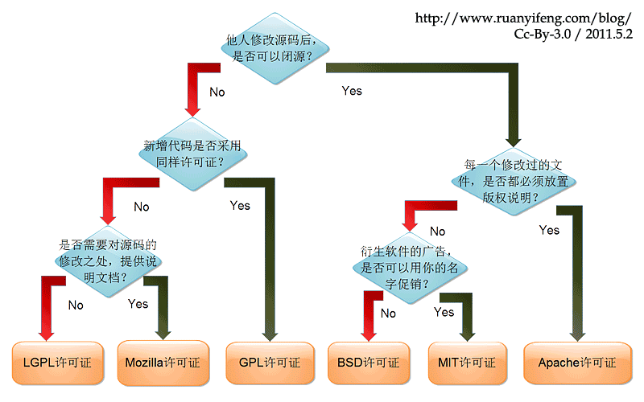

# 大数据相关框架对比
对比大数据场景中所使用到的开源框架，包括框架特性、模型、功能、性能、应用场景以及发展方向  
  
## 0. 前言  

* todo 大数据定义
* todo 大数据特征
* todo 大数据技术
* todo 大数据应用
* todo 大数据发展方向

在使用或学习大数据相关组件前，我们应该了解以下前置知识，包括开源许可证的种类与选择。

### 0.1 开源许可证
互联网环境下，无论是在企业中开发还是个人进行创作，只要遇到**开源软件**（小到远程控制工具OpenSSH，JAVA编程语言，大到Linux操作系统），都会见到**开源许可证**的影子，
此外，作者没有使用开源许可证的作品并不意味着该作品不受保护，恰恰相反，没有开源许可证的作品意味着用户仅能看源码而不能使用。
以下列举常见的7种开源许可证，基本覆盖日常应用
> 
> 图片来源于：阮一峰的网络日志

## 1. 文件系统
分析Hadoop Distributed File System（HDFS）与目前主流单机文件系统（以Linux为例）之间的关系对理解大数据相关框架所解决的问题具有重要意义。
### 1.1 HDFS
分布式文件系统是大数据处理的基石，而HDFS作为大数据领域中最常见的分布式文件系统，有着以下特性：
1. 高容错性，通过在集群的不同节点放置文件的多个副本来避免单点故障，以达到高容错性。
2. 高吞吐量，将文件分块存储，并利用多机并行处理，达到高吞吐量的文件读写操作。
3. 低成本，HDFS被设计成部署在低廉的硬件上，这些硬件通过网络进行互连，形成一个虚拟的整体，提供给用户统一的IO接口。
4. 可拓展性，在集群不重启的情况下，新节点只需要通过向NameNode注册添加DataNode即可完成集群的空间热扩容。
#### 1.1.1 存储模型
HDFS的结构是一种主/从模型，有一个主服务器（NameNode）负责该文件系统元数据（每个block占用元数据150字节）的管理以及相应用户的访问。同时，文件的具体数据按照固定大小的块被切分并存储到DataNode上，用户对文件的读写将被DataNode实际处理。
> 
> 图片来源于：Hadoop官网
#### 1.1.2 心跳机制
DataNode定期给NameNode发送心跳信息，NameNode接受到来自DataNode的心跳信息或者长时间未接收到心跳信息都会进行处理：
* **心跳信息处理**  
  + 判断自身DataNode是否注册，否则在NameNode注册（动态添加）
  + 更新DataNode的负载信息（更新集群信息）
  + NameNode生成IO指令，返回给DataNode（响应用户读写操作或系统更新操作）
* **心跳检查**（长时间未收到心跳信息）
  + 超时时长公式 `timeout = 2 * heartbeat.recheck.interval + 10 * dfs.heartbeat.interval`，其中，默认的heartbeat.recheck.interval 大小为5分钟，dfs.heartbeat.interval默认为3秒。
  + 当超过该阈值时长时，DataNode仍然没有发送心跳信息到NameNode，NameNode就会标记该DataNode死亡。
#### 1.1.3 HDFS副本存放机制（四大机制）
  * 第一个副本，如果写请求方式是集群中的一个DataNode，直接存放在该节点上，否则在集群中随机选择一个DataNode
  * 第二个副本，存放于不同于第一个副本所在的机架的DataNode上
  * 第三个副本，存放于第二个副本所在机架的不同节点上
  * 如果多余三个副本，随机存放在集群中的各个节点上
#### 1.1.4 启动过程
HDFS的启动过程分为四个阶段：
* 第一阶段：NameNode 读取包含元数据信息的FSImage文件，并加载到内存；
* 第二阶段：NameNode读取体现HDFS最新状态的EditLog日志文件，并加载到内存中
* 第三阶段：生成检查点，SecondaryNameNode将EditLog日志中的信息合并到FSImage文件中
* 第四阶段：进入安全模式，检查数据块的完整性
#### 1.1.5 检查点机制（四大机制）
> 
> 图片来源Github
#### 1.1.6 安全模式（四大机制）
NameNode在启动或客户端设置，会进入安全模式。安全模式用于恢复元数据，即合并FSImage以及EditLog，接受DataNode的心跳信息，构建文件系统抽象目录树关系以及数据块与数据节点之间的关系  
NameNode在安全模式下，有以下特点：
1. 不修改系统的命名空间
2. 不删除或复制块  
#### 1.1.7 负载均衡（四大机制）
在集群空闲时进行负载均衡，进行负载均衡的带宽默认1M
#### 1.1.8 高可用High Available(HA)
HA的目标是消除单点故障。通过部署多个NameNode进行主备切换来消除单点故障，其中只有一个Active NameNode可以进行EditLog的写，其余Standby NameNode只可以进行读（官网上提供两种实现方式：Journal Node 以及 Network File System(NFS)）。故障转移流程如下图所示：
> 
> 图片来源CSDN  

其中，为了防止脑裂（由于网络原因，出现多个自认为是Master的节点），ZK提供了预防脑裂的方法，隔离（fencing）：
1. 直接ssh到失效NameNode kill掉程序
2. 执行自定义脚本
3. 同一时间，只允许一个NameNode向Journal Node写数据，只允许一个NameNode响应客户端的请求，只允许一个NameNode向DataNode发指令
#### 1.1.9 HDFS联邦机制
HDFS的1.x版本采用一个NameNode管理命名空间以及数据块信息。这样做的缺点有：
1. 命名空间跟数据块信息高度耦合
2. NameNode拓展性受限
3. 系统性能（吞吐量）受限于NameNode
4. 不能保障数据的隔离性
5. 存在单点故障问题

HDFS的2.x版本采用联邦机制，引入块池（block pool）以及命名空间卷（namespace volumn），每个block pool存储于DataNode上，一个NameSpace以及对应的block pool被称为namespace volume，是升级的基本单位，如图所示：
>   
> 图片来源HDFS官网

联邦机制的优点：
1. 支持NameNode水平拓展，支持命名空间卷隔离
2. 多个NameNode提高吞吐量
3. 高可用性（解决单点故障）
#### 1.1.10 HDFS读写数据流程
> 读文件流程：
> 
> 写文件流程：
>   
> 图片来源Github
#### 1.1.11 HDFS支持的操作
| 用户命令 | 管理命令 | 
| :-----: | :-----: |
| classpath fetchdt fsck getconf groups lsSnapshottableDir jmxget oev oiv oiv_legacy snapshotDiff version **appendToFile cat checksum chgrp chmod chown copyFromLocal copyToLocal count cp createSnapshot deleteSnapshot df du dus expunge find get getfacl getfattr getmerge help ls lsr mkdir moveFromLocal moveToLocal mv put renameSnapshot rm rmdir rmr setfacl setfattr setrep stat tail test text touchz truncate** | balancer cacheadmin crypto datanode dfsadmin dfsrouter dfsrouteradmin haadmin journalnode mover namenode nfs3 portmap secondarynamenode storagepolicies zkfc |
#### 1.1.11 接口与具体实现
> tood 详情，参考[HDFS 接口与具体实现](./HDFS/main.md)

### 1.2 Linux文件系统
在Unix/Linux系统中有一个重要的概念：一切皆文件。因此，Linux的文件系统管理着所有所能管理的东西。
#### 1.2.1 文件系统层次
当用户程序需要调用IO接口时，将会由Glibc库转化为系统调用（SCI层），并由虚拟文件系统抽象出具体文件系统的实现，最终转化为设备驱动指令，达到读写文件或设备的目的。
>  图片来源于：ChinaUnix博客  

其中，了解Linux文件系统的抽象——虚拟文件系统（Virtual File System，VFS），有助于从宏观的角度认识Linux文件系统。
#### 1.2.2 统一文件模型
针对不同文件类型**普通文件，目录，设备，套接字**），Linux为它们提供了统一的操作接口，即VFS标准接口。定义标准接口需要预先定义标准对象，VFS提出统一文件模型来定义四种对象，这些对象将作为VFS标准接口的基础。
* superblock：存储文件系统基本的元数据。（支持挂载多个文件系统，因此superblock是一条链表，记录所有挂载的文件系统信息，包括根目录信息、支持的操作、状态以及容量大小等）
* index node（iNode）：保存一个文件相关的元数据。包括文件的所有者（用户、组）、访问时间、文件类型等，但不包括这个文件的名称。文件和目录均有具体的inode对应，一个block在ext3占用128字节，ext4和xfs占用256字节。
* directory entry（Dentry）：保存了文件（目录）名称和具体的inode的对应关系，用来粘合二者，同时可以实现目录与其包含的文件之间的映射关系。另外也作为缓存的对象，缓存最近最常访问的文件或目录，提示系统性能
* file：一组逻辑上相关联的数据，被一个进程打开并关联使用（由多个block实际存储数据默认占用4k字节，硬盘物理扇区512字节）
四者的关系如图所示：
>    
> 图片来源CSDN
#### 1.2.3  VFS所支持的系统调用
| 文件系统相关 | 目录相关 | 链接相关 | 文件相关 |
| :-----: | :----: | :----: | :----: |
| mount, umount, umount2, sysfs,  statfs,  fstatfs,  fstatfs64, ustat | chroot，pivot_root，chdir，fchdir，getcwd，mkdir，rmdir，getdents，getdents64，readdir，link，unlink，rename，lookup_dcookie  | readlink，symlink | chown， fchown，lchown，chown16，fchown16，lchown16，hmod，fchmod，utime，stat，fstat，lstat，acess，oldstat，oldfstat，oldlstat，stat64，lstat64，lstat64，open，close，creat，umask，dup，dup2，fcntl， fcntl64，select，poll，truncate，ftruncate，truncate64，ftruncate64，lseek，llseek，read，write，readv，writev，sendfile，sendfile64，readahead |

### 1.3 HDFS与Linux文件系统的关系
* HDFS的实现基于Linux文件系统
* HDFS考虑分布式环境，Linux文件系统不考虑分布式环境
* 两者设计目标不同，不构成竞争
* HDFS不支持链接，VFS支持软、硬链接
* Linux的文件包含普通文件、目录、设备以及Socket，HDFS的文件仅对应文件数据
* HDFS的一个数据块（Block）存储在多个节点，VFS的一个Block存储在一个设备

