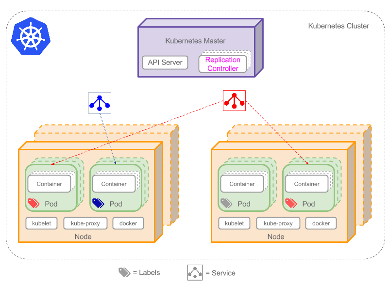
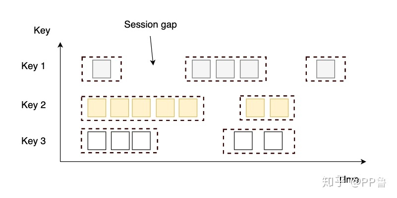
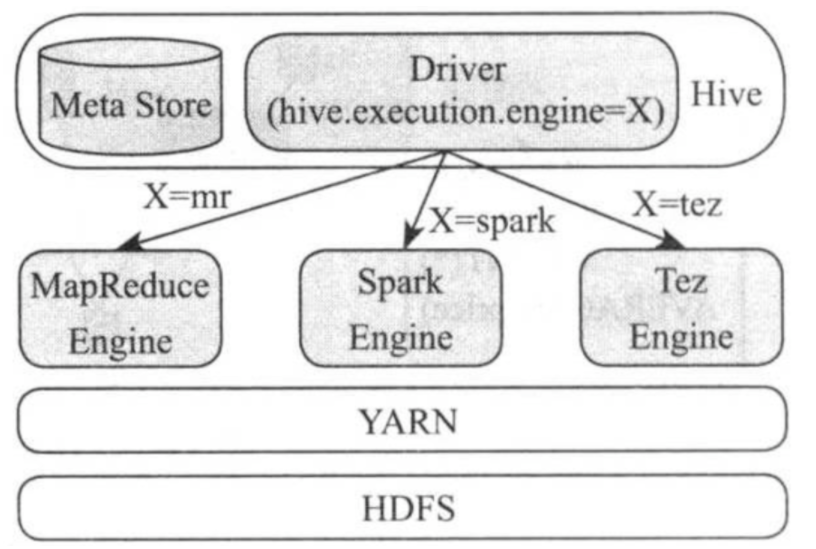

# 大数据处理相关框架对比
对比大数据场景中所使用到的开源框架，包括框架特性、模型、功能、性能、应用场景以及发展方向  
  
## 0. 前言  

* todo 大数据定义
* todo 大数据特征
* todo 大数据技术
* todo 大数据应用
* todo 大数据发展方向

在使用或学习大数据相关组件前，我们应该了解以下前置知识，包括开源许可证的种类与选择。

### 0.1 开源许可证
互联网环境下，无论是在企业中开发还是个人进行创作，只要遇到**开源软件**（小到远程控制工具OpenSSH，JAVA编程语言，大到Linux操作系统），都会见到**开源许可证**的影子，
此外，作者没有使用开源许可证的作品并不意味着该作品不受保护，恰恰相反，没有开源许可证的作品意味着用户仅能看源码而不能使用。
以下列举常见的7种开源许可证，基本覆盖日常应用
> 
> 图片来源于：阮一峰的网络日志

### 0.2 Hadoop版本
#### 0.2.1 Apache版本
#### 0.2.2 Cloudera版本（CDH）
#### 0.2.3 Hortonworks版本（HDP）

## 1. 文件系统
分析Hadoop Distributed File System（HDFS）与目前主流单机文件系统（以Linux为例）之间的关系对理解大数据相关框架所解决的问题具有重要意义。
### 1.1 HDFS
分布式文件系统是大数据处理的基石，而HDFS作为大数据领域中最常见的分布式文件系统，有着以下特性：
1. 高容错性，通过在集群的不同节点放置文件的多个副本来避免单点故障，以达到高容错性。
2. 高吞吐量，将文件分块存储，并利用多机并行处理，达到高吞吐量的文件读写操作。
3. 低成本，HDFS被设计成部署在低廉的硬件上，这些硬件通过网络进行互连，形成一个虚拟的整体，提供给用户统一的IO接口。
4. 可拓展性，在集群不重启的情况下，新节点只需要通过向NameNode注册添加DataNode即可完成集群的空间热扩容。
#### 1.1.1 存储模型
HDFS的结构是一种主/从模型，有一个主服务器（NameNode）负责该文件系统元数据（每个block占用元数据150字节）的管理以及相应用户的访问。同时，文件的具体数据按照固定大小的块被切分并存储到DataNode上，用户对文件的读写将被DataNode实际处理。
> 
> 图片来源于：Hadoop官网
#### 1.1.2 HDFS联邦机制
HDFS的1.x版本采用一个NameNode管理命名空间以及数据块信息。这样做的缺点有：
1. 命名空间跟数据块信息高度耦合
2. NameNode拓展性受限
3. 系统性能（吞吐量）受限于NameNode
4. 不能保障数据的隔离性
5. 存在单点故障问题

HDFS的2.x版本采用联邦机制，引入块池（block pool）以及命名空间卷（namespace volumn），每个block pool存储于DataNode上，一个NameSpace以及对应的block pool被称为namespace volume，是升级的基本单位，如图所示：
>   
> 图片来源HDFS官网

联邦机制的优点：
1. 支持NameNode水平拓展，支持命名空间卷隔离
2. 多个NameNode提高吞吐量
3. 高可用性（解决单点故障）
#### 1.1.3 启动过程
HDFS的启动过程分为四个阶段：
* 第一阶段：NameNode 读取包含元数据信息的FSImage文件，并加载到内存；
* 第二阶段：NameNode读取体现HDFS最新状态的EditLog日志文件，并加载到内存中
* 第三阶段：生成检查点，SecondaryNameNode将EditLog日志中的信息合并到FSImage文件中
* 第四阶段：进入安全模式，检查数据块的完整性
#### 1.1.4 心跳机制（四大机制）
DataNode定期给NameNode发送心跳信息，NameNode接受到来自DataNode的心跳信息或者长时间未接收到心跳信息都会进行处理：
* **心跳信息处理**  
  + 判断自身DataNode是否注册，否则在NameNode注册（动态添加）
  + 更新DataNode的负载信息（更新集群信息）
  + NameNode生成IO指令，返回给DataNode（响应用户读写操作或系统更新操作）
* **心跳检查**（长时间未收到心跳信息）
  + 超时时长公式 `timeout = 2 * heartbeat.recheck.interval + 10 * dfs.heartbeat.interval`，其中，默认的heartbeat.recheck.interval 大小为5分钟，dfs.heartbeat.interval默认为3秒。
  + 当超过该阈值时长时，DataNode仍然没有发送心跳信息到NameNode，NameNode就会标记该DataNode死亡。
#### 1.1.5 检查点机制
> 
> 图片来源Github
#### 1.1.6 安全模式（四大机制）
NameNode在启动或客户端设置，会进入安全模式。安全模式用于恢复元数据，即合并FSImage以及EditLog，接受DataNode的心跳信息，构建文件系统抽象目录树关系以及数据块与数据节点之间的关系  
NameNode在安全模式下，有以下特点：
1. 不修改系统的命名空间
2. 不删除或复制块  
#### 1.1.7 负载均衡（四大机制）
在集群空闲时进行负载均衡，进行负载均衡的带宽默认1M
#### 1.1.8 HDFS副本存放机制（四大机制）
  * 第一个副本，如果写请求方式是集群中的一个DataNode，直接存放在该节点上，否则在集群中随机选择一个DataNode
  * 第二个副本，存放于不同于第一个副本所在的机架的DataNode上
  * 第三个副本，存放于第二个副本所在机架的不同节点上
  * 如果多余三个副本，随机存放在集群中的各个节点上
#### 1.1.9 高可用High Available(HA)
HA的目标是消除单点故障。通过部署多个NameNode进行主备切换来消除单点故障，其中只有一个Active NameNode可以进行EditLog的写，其余Standby NameNode只可以进行读（官网上提供两种实现方式：Journal Node 以及 Network File System(NFS)）。故障转移流程如下图所示：
> 
> 图片来源CSDN  

其中，为了防止脑裂（由于网络原因，出现多个自认为是Master的节点），ZK提供了预防脑裂的方法，隔离（fencing）：
1. 直接ssh到失效NameNode kill掉程序
2. 执行自定义脚本
3. 同一时间，只允许一个NameNode向Journal Node写数据，只允许一个NameNode响应客户端的请求，只允许一个NameNode向DataNode发指令

#### 1.1.10 HDFS读写数据流程
> 读文件流程：
> 
> 写文件流程：
>   
> 图片来源Github
#### 1.1.11 HDFS支持的操作
| 用户命令 | 管理命令 | 
| :-----: | :-----: |
| classpath fetchdt fsck getconf groups lsSnapshottableDir jmxget oev oiv oiv_legacy snapshotDiff version **appendToFile cat checksum chgrp chmod chown copyFromLocal copyToLocal count cp createSnapshot deleteSnapshot df du dus expunge find get getfacl getfattr getmerge help ls lsr mkdir moveFromLocal moveToLocal mv put renameSnapshot rm rmdir rmr setfacl setfattr setrep stat tail test text touchz truncate** | balancer cacheadmin crypto datanode dfsadmin dfsrouter dfsrouteradmin haadmin journalnode mover namenode nfs3 portmap secondarynamenode storagepolicies zkfc |
#### 1.1.11 接口与具体实现
> tood 详情，参考[HDFS 接口与具体实现](./HDFS/main.md)

* todo 应用场景
* todo 发展方向
### 1.2 Linux文件系统
在Unix/Linux系统中有一个重要的概念：一切皆文件。因此，Linux的文件系统管理着所有所能管理的东西。
#### 1.2.1 文件系统层次
当用户程序需要调用IO接口时，将会由Glibc库转化为系统调用（SCI层），并由虚拟文件系统抽象出具体文件系统的实现，最终转化为设备驱动指令，达到读写文件或设备的目的。
>  图片来源于：ChinaUnix博客  

其中，了解Linux文件系统的抽象——虚拟文件系统（Virtual File System，VFS），有助于从宏观的角度认识Linux文件系统。
#### 1.2.2 统一文件模型
针对不同文件类型**普通文件，目录，设备，套接字**），Linux为它们提供了统一的操作接口，即VFS标准接口。定义标准接口需要预先定义标准对象，VFS提出统一文件模型来定义四种对象，这些对象将作为VFS标准接口的基础。
* superblock：存储文件系统基本的元数据。（支持挂载多个文件系统，因此superblock是一条链表，记录所有挂载的文件系统信息，包括根目录信息、支持的操作、状态以及容量大小等）
* index node（iNode）：保存一个文件相关的元数据。包括文件的所有者（用户、组）、访问时间、文件类型等，但不包括这个文件的名称。文件和目录均有具体的inode对应，一个block在ext3占用128字节，ext4和xfs占用256字节。
* directory entry（Dentry）：保存了文件（目录）名称和具体的inode的对应关系，用来粘合二者，同时可以实现目录与其包含的文件之间的映射关系。另外也作为缓存的对象，缓存最近最常访问的文件或目录，提示系统性能
* file：一组逻辑上相关联的数据，被一个进程打开并关联使用（由多个block实际存储数据默认占用4k字节，硬盘物理扇区512字节）
四者的关系如图所示：
>    
> 图片来源CSDN
#### 1.2.3 软链接和硬链接
假如A是B的硬链接，则A的Dentry指向的iNode与B的Dentry指向的iNode是同一块内存地址，删除任意A或者B不会影响剩余目录对该文件的访问，但**不能跨文件系统，不能对目录**进行硬链接。  
假如A是B的软链接，则A的Dentry指向的iNode与B的Dentry指向的iNode不同，A所存储的数据为B的路径名，通过A所存储的路径可最终找到B文件。
#### 1.2.4  VFS所支持的系统调用
| 文件系统相关 | 目录相关 | 链接相关 | 文件相关 |
| :-----: | :----: | :----: | :----: |
| mount, umount, umount2, sysfs,  statfs,  fstatfs,  fstatfs64, ustat | chroot，pivot_root，chdir，fchdir，getcwd，mkdir，rmdir，getdents，getdents64，readdir，link，unlink，rename，lookup_dcookie  | readlink，symlink | chown， fchown，lchown，chown16，fchown16，lchown16，hmod，fchmod，utime，stat，fstat，lstat，acess，oldstat，oldfstat，oldlstat，stat64，lstat64，lstat64，open，close，creat，umask，dup，dup2，fcntl， fcntl64，select，poll，truncate，ftruncate，truncate64，ftruncate64，lseek，llseek，read，write，readv，writev，sendfile，sendfile64，readahead |

* todo 应用场景
* todo 发展方向
### 1.3 HDFS与Linux文件系统的关系
* HDFS的实现基于Linux文件系统
* HDFS考虑分布式环境，Linux文件系统不考虑分布式环境
* 两者设计目标不同，不构成竞争
* HDFS不支持链接，VFS支持软、硬链接
* Linux的文件包含普通文件、目录、设备以及Socket，HDFS的文件仅对应文件数据
* HDFS的一个数据块（Block）存储在多个节点，VFS的一个Block存储在一个设备

## 2. 资源管理与调度监控系统
目前主流的资源管理与调度监控系统包括YARN、Mesos（Apache）、Borg以及Kubernetes（Google）。他们的共同目标都是对集群的资源进行统一管理以及对运行在集群上的任务进行调度与监控，提高集群的资源利用率，降低管理成本。
### 2.1 YARN
YARN是一种资源管理与调度监控系统，由MapReduce version 1演变而来。
#### 2.1.1 MapReduce version 1（MRv1）
在MRv1中有两类角色：JobTracker和TaskTracker，JobTracker负责资源的管理以及任务的调度，TaskTracker负责任务的执行并返回信息给JobTracker，如图所示：
>   
> 图片来源Hadoop官网

这样的结构会产生以下问题：
1. 可拓展差，由于JobTracker同时负责资源的管理以及任务的调度，在管理节点较多以及执行任务较多的情况下，JobTracker容易成为系统性能瓶颈
2. 可用性低，采用Master/Slave架构，但实际上Master有且只有一个，当Master发送故障时，系统无法提供服务
3. 利用率低，MRv1采用静态资源配置，每个TaskTracker将可用资源划分成Map Slot以及Reduce Slot，两者不可资源共享，导致资源利用率低下
4. 不支持多种计算框架，仅支持MapReduce离线计算，不支持内存计算框架，也不支持流式计算框架

由于以上限制，MRv1仅支持4000左右个节点。
为了解决上述种种限制，Apache对MRv1进行优化，提出了MapReduce Version 2（MRv2），其中YARN便是MRv2中的核心内容。
#### 2.1.2 YARN系统结构 
如图所示，YARN中有三种节点：ResourceManager（RM）、NodeManager（NM）以及MRAppMaster（APPMaster）。其中RM负责资源的管理、APPMaster负责任务的调度与监控、NM负责Map/Reduce任务的实际执行
>   
> 图片来源于Hadoop官网

通信方式：YARN与Mesos均采用心跳机制进行通信以及信息更新。
#### 2.1.3 资源调度器
由于集群资源有限，在多用户、多任务环境下，需要一个资源调度器针对有限的资源进行任务的有序调度。默认实现为容量调度器（Capacity Scheduler）。
1. FIFO调度器
先进先出，为先来的应用分配资源，满足第一个后依次为下一个提供服务。不适合集群
2. 容量调度器（默认）
允许多个组织共享整个集群。每个组织有专门的队列（FIFO）以及整个集群中一部分的计算能力，同时提出弹性队列概念，即某个队列由于任务太多而导致资源不够用时，容量调度器会将空闲队列的资源分配给繁忙队列的任务，但容量调度器不会强制要求其他队列释放资源
3. 公平调度器
每个用户在启动任务时同时产生一个任务队列，各个任务队列共享集群资源（均分），每个队列内部在按照内存公平共享或FIFO共享资源
#### 2.1.4 资源隔离机制
YARN中的Container是封装了一定量CPU和内存资源的JAVA对象。
1. 内存隔离机制 采用额外的监控进程，监控Container的内存使用情况，当超过约定的内存资源量时（考虑了JVM创建子进程内存翻倍的情况），就会被杀死
2. CPU隔离机制 考虑到不同节点的CPU性能不同，提出虚拟CPU概念，更强计算能力设置更多的虚拟CPU。最终采用Linux所提供的Cgroups进行限制，内存不能用Cgroups限制是因为JVM创建子进程时内存会翻倍出现抖动情况
#### 2.1.5 负载不均衡问题
节点任务负载不均衡现象：通过心跳机制领取任务，优先发送心跳的会领取更多的任务。
为避免上述情况，如果采用公平调度器将yarn.scheduler.fair.max.assign设置为1（默认是-1），如果容量调度器则不能配置。
但是，一般而言，任务数量远大于节点数量，集群的所有节点都会处于忙碌状态。
#### 2.1.6 高可用以及任务恢复
YARN提供了恢复机制，这使得YARN在服务出现故障和人工重启时，不会对正在运行的应用程序产生任何影响（高可用）。YARN的高可用包括以下三个部分：RM HA、RM重启以及NM重启。
1. RM HA：采用Active/Standy RM以及ZK主备切换解决单点故障问题，并通过RM重启（第二点）恢复服务
2. RM重启：RM在运行过程中会将状态存储在ZK中，当发送重启或者故障时，新启动的RM在ZK中重新读取信息，重启后各个NM向其进行注册，返回所管理的容器信息，APPMaster也会重新发送资源请求
3. 当NM就地重启时，原有运行的Container不会被杀死，而是等新的NM接管并继续运行
* todo 应用场景
* todo 发展方向
### 2.2 Mesos
Mesos同样是Apache的基于Master/Slave架构的资源管理框架，不过Mesos不负责任务的调度以及监控，Mesos最多支持六万个左右节点。
#### 2.2.1 Mesos系统结构
Mesos的组成包括Master、Slave、Framework Scheduler以及Framework executor等角色。如图所示：
> 
> 图片来源Mesos官网

其中，Master管理集群中所有Slave的资源，Framework向Master申请资源并将所得到的资源按Framework Scheduler分配策略执行。如图所示：
> 
> 图片来源Mesos官网

#### 2.2.2 资源调度器
Mesos的资源调度器采用Dominant Resource Fairness（DRF）算法，该论文是一种针对不同资源类型的max-min fairness算法，核心思想：最大化所有用户中最小的Dominant share，其中，用户的Dominant share是用户最需要资源在集群中所占的份额（如，CPU密集型任务的Dominant share为所分配的CPU占集群总CPU的百分比）。
> 详情参考论文Dominant Resource Fairness: Fair Allocation of Multiple Resource Types

Mesos支持粗粒度与细粒度资源调度。其中粗粒度指的是，获得资源后就长期持有，直至程序退出才释放资源，细粒度指的是，根据实际需要动态申请资源，任务完成后就释放资源。Mesos在各个Framework之间进行粗粒度的资源分配，每个框架根据自身任务特点进行细粒度的任务调度。相比之下，YARN支持细粒度调度，MRv1支持粗粒度调度。
#### 2.2.3 资源隔离机制
Mesos与YARN均支持Cgroups对应用进行容器隔离。
> Mesos论文在《3.4 隔离》这一章节就写了几行
#### 2.2.4 高可用
与YARN一样使用ZK进行容错，细节不再赘述
* todo 应用场景
* todo 发展方向
### 2.3 Borg
Borg可支持数万节点，在谷歌内部成功运用了十多年的大规模集群管理系统，可以实现在同一集群中同时调度在线任务和离线任务（相比之下，YARN以及Mesos仅擅长部署离线任务）。
#### 2.3.1 系统结构
运行Borg系统的集群被称为一个Cell，包含一个控制器BorgMaster以及一组执行者Borglet。如图所示：
> 
> 图片来源于Google介绍Borg的论文

其中，BorgMaster通常有五个副本，实际上只有一个实例为用户提供服务，其余副本维护主BorgMaster的一份内存副本，以避免主BorgMaster发生单点故障，同时在Cell启动或主BorgMaster发生故障时，会通过Paxos算法进行选举新的主BorgMaster。
#### 2.3.2 通信机制
与YARN、Mesos的心跳机制不同，BorgMaster的五个实例都采用周期性主动poll各个Borglet以获取其状态和资源使用情况，最终通过压缩和求差之后发送给主BorgMaster，同时也存在超时触发容错机制，这样做的目的是更容易控制网络通信开销，避免选举时出现网络风暴。
#### 2.3.3 资源调度器
BorgMaster会将提交的Job记录到Paxos中，并分配优先级：生产型作业或非生产型作业，并将这个Job的所有task都加入阻塞队列，并采用其调度算法进行调度，调度算法包括以下两个部分：可行性检查（feasibility checking）以及打分（scoring）。  
可行性检查会找出所有可以安排的节点，打分会为每个任务（task）找出最适合的节点进行执行。打分环节会考虑到：
1. 销毁最少的任务来执行本任务 
2. 是否具有任务软件包 
3. 将高优先级跟低优先级分配到桶一个节点。

为了避免抢占洪流，Borg只允许生产型作业抢占非生产型作业。由于Borg允许抢占式执行，解决了饥饿问题，即当节点A有10G内存，同时被一个长期运行的任务B占用4G内存，任务C所需求的10G内存永远不能满足，使得任务C饥饿。YARN、Mesos不能解决饥饿问题。
#### 2.3.3 资源隔离机制
与YARN、Mesos一样，采用Cgroups隔离，Cgroups由google开源。
#### 2.3.4 提高资源利用率方法
1. 处理单元共享（Cell Share）：混合部署生产和非生产任务
2. 大处理单元（Large Cell）：处理单元越大越好
3. 细粒度资源请求（Fine-Grained Resource）：细粒度的资源请求有利于资源回收
4. 资源超售（Resource Reclamation）：为避免用户为任务预留过多的资源，采用资源回收的方式将该任务的预留资源逐渐回收。
> 
> 图片来源于CSDN
* todo 应用场景
* todo 发展方向
### 2.4 Kubernetes
Kubernetes是一个开源的容器编排管理平台，简称k8s，管理集群上容器化的应用程序，可实现服务注册、发现以及四层或七层负载均衡等功能。
#### 2.4.1 系统结构
k8s集群由一组运行容器化应用程序的节点组成，主要角色包括管理者k8sMaster以及在Node上运行的kubelet，其中kubelet负责接收Master的指令和维护Pod状态，Master负责对外提供服务以及给kubelet发出指令。一个Pod代表一组容器和卷，共享一个网络命名空间，因此一个Pod内的容器可以通过localhost进行通信，不同pod之间通过Label、内置的DNS-server和kube-proxy进行通信。
> 
> 图片来源dockone.io
* todo 资源调度
* todo 负载均衡
* todo 服务发现与注册
* todo 资源隔离
* todo 应用场景
* todo 发展方向
### 2.5 四种资源管理系统对比
| 技术 | 用途 |资源调度器|隔离机制|高可用|通信机制|支持节点数|
|:---:|:---:|:---:|:---:|:---:|:---:|:---:|
|**YARN**|资源管理与任务调度和监控|容量调度器|Cgroups+进程监控|ZK|心跳机制|数万|
|**Mesos**|资源管理|DRF算法|Cgroups|ZK|心跳机制|数万|
|**Borg**|资源管理与任务调度和监控|打分机制|Cgroups|Paxos选举|主动Poll|数万|
|**k8s**|容器编排|打分机制|Cgroups|etcd+HA Proxy|心跳机制|数千|

## 2. 离线计算范式
离线计算指的是批处理计算，如离线报表、数据分析等应用，离线计算相对于在线计算有以下特点：
1. 计算量大
2. 数据量大
3. 数据不发生变化
4. 运行周期长
### 2.1 MapReduce
MapReduce是一个基于集群的高性能并行计算范式，允许用户通过编写简单的Map和Reduce方法来实现计算任务的并行处理而不用关心其并行化的实现细节以及任务的容错处理，减轻了开发人员的负担。  
#### 2.1.1 Map流程
首先我们了解MapReduce的流程，Map任务的流程如图所示：
> 
> 图片来源Github

重点流程：Map任务默认采用TextInputFormat（InputFormat实现类）的RecordReader（成员变量）的read()方法读取外部数据并返回kv键值。然后对每个kv键值调用map()方法，当context.write()被调用时，数据会被写到环形缓冲区中（默认100MB），当缓冲区写满后，对缓冲区的内容进行排序（快排与归并排序）与压缩，这个期间会产生多个临时小文件，但最后合并成一个文件，让Reduce任务从这个文件中读取数据。
#### 2.1.2 Reduce流程
Reduce任务的流程图如图所示：
> 
> 图片来源Github

重点流程：Reduce任务通过网络向Map任务的输出文件获取对应分区的数据，并调用reduce()方法，最终调用OutputFormat.RecordWriter的write方法将结果写入到HDFS或其他数仓中。
#### 2.1.3 Hadoop实现的输入格式
InputFormat的实现类包括：TextInputFormat、KeyValueTextInputFormat以及SequenceFileInputFormat
1. TextInputFormat：默认读取方式，Value是一行数据
2. KeyValueTextInputFormat：每一行都是键值对，用制表符隔开
3. SequenceFileInputFormat：二进制的键值对，键值对都是可序列化的

#### 2.1.4 环形缓冲区底层
采用字节数组实现，前半部分记录KV索引位置，后半部分记录KV数据。读写过程采用单生产者消费者模式。如图所示：
> 
> 图片来源CSDN
#### 2.1.5 Shuffle的缺陷
* 磁盘IO问题：每个Map都会有多个溢写文件写入到磁盘
* 网络IO问题：当数据量较少，但Map和Reduce任务很多时，会产生较多网络IO
#### 2.1.6 全排序
在MR中实现全局排序有以下三种方法：
1. 设置一个Reduce方法，所有Map方法得到的结果都会发送到Reduce并进行排序
2. 自定义分区函数的分界点，按照排序的Key进行分区，分区之间有序，分区内部有序，从而全局有序（会出现数据倾斜的问题）
3. 基于数据采样的全局排序，对待排序数据进行抽样（分片采样，随机采样，间隔采样），产生分割点，按照第二种方式排序。
#### 2.1.7 辅助排序（二次排序）
自定义组合键，在Map方法中将键值对的键改为键值的组合键，然后自定义分区函数以及排序函数（Comparator），在Shuffle中完成键的排序以及值的排序。（MR默认会在Shuffle对键进行排序）。
### 2.2 Spark
Spark是加州大学伯克利分校（UC Berkeley）开源的基于内存的通用并行框架。相比于MapReduce，Spark将数据缓存在内存中，减少了多余的IO消耗，直到计算得到最后的结果再将结果写入磁盘中。  
Spark包含以下四个模块：
1. Spark SQL：基于Spark的SQL查询引擎，将SQL转化为Spark RDD运行（类似Hive将SQL转化为MR）
2. Spark MLlib：提供支持集群模式的机器学习算法
3. Spark GraphX：提供基于图的算法，如PageRank
4. Spark Streaming：Spark的流式计算框架，处理实时数据（类似Flink）

本章节将会对比Spark与MapReduce的系统架构以及原理，Spark SQL与Spark Streaming将在后续章节提及。
#### 2.2.1 系统架构
Spark的核心类是弹性分布式数据集（Resilience Distributed Dataset, RDD），封装了一个存在依赖关系、容错、可并行、弹性（自动在内存与硬盘之间切换）的数据集。  

Spark集群存在以下角色：DAGScheduler、TaskScheduler以及Executor。Spark应用程序从提交到被执行的基本流程如图所示：
> 
> 图片来源CSDN

首先，用户程序启动SparkContext，系统自动初始化DAGScheduler以及TaskScheduler，DAGScheduler根据用户提交的有向无环图进行调度，按照拓扑序遍历RDD，当遇到窄依赖时，将当前RDD放入当前Stage，遇到宽依赖新增一个Stage。每个Stage按照分区函数（HashPatitioner和RangePatitioner）划分出一个TaskSet，交给TaskScheduler进行调度。TaskScheduler为每个task分配计算资源并提交到Executor执行。  
此外，Spark支持四种运行模式：
1. Local模式，用来调试代码
2. Standalone模式，独立部署模式，Spark自带的集群部署模式，不依赖于其他资源管理系统独立运行Spark分布式程序
3. YARN模式，将Spark任务交给YARN调度
4. Mesos模式，将Mesos交给Mesos调度，Mesos支持粗粒度以及细粒度调度（参考第一章）
#### 2.2.2 RDD算子
RDD的基本算子包括三种：转化算子（Transformation）、行动算子（Action）、控制算子（Controller）。
1. 转化算子：包括map、filter、flatMap、sample、groupByKey，将一个RDD转化为新的RDD
2. 行动算子：包括count、coect、reduce、save，将一个RDD转化为Scala基本类型
3. 控制算子：包括cache、persis指令，将RDD在内存或硬盘中进行缓存
#### 2.2.3 容错机制
不同于MapReduce将容错交给YARN处理，Spark针对三大层面（调度层、任务层、节点层），RDD容错有以下处理方法：
1. DAG调度：Stage输出失败，DAGScheduler进行重试重新调度DAG
2. task计算失败：Executor对失败的task进行重新计算
3. 节点死机：RDD血缘（Lineage）容错+检查点容错，针对窄依赖的RDD丢失，可以重算其父RDD完成容错，针对宽依赖，重算的计算开销较大，可采用checkpoint备份，当数据丢失时，从checkpoint开始算即可。
#### 2.2.4 Shuffle
与MR类似，Spark的两个Stage之间通过Shuffle进行连接，前一个Stage的最后一个RDD作为Map任务，后一个Stage的第一个RDD作为Reduce任务。
Spark的Shuffle实现方式包括Hash Based Shuffle（弃用）和Sort Based Shuffle，其中Hash Based Shuffle会产生多个临时文件并影响性能，在Spark1.2及后续版本中已经弃用。    
当分区数较少时（小于200）并且Map任务没有聚合操作，会采用BypassMergeSortShuffleWriter（没有排序，最终合并成一个文件）进行溢写磁盘，当分区数少于16777216并且没有Map端聚合操作时，采用UnsafeShuffleWriter（分区内有序）进行溢写磁盘，其他情况采用SortShuffleWriter（全局有序）进行溢写。
相比于MR的Shuffle做出的优化：
1. 对分区数少并且没有聚合类shuffle算子（reduceByKey）不进行排序，提高了性能。
2. 采用AppendOnlyMap/ExternalAppendOnlyMap减少了内存使用量
3. 对于Shuffle read的文件为本地文件，MR采用网络下载数据，Spark直接读取本地文件
#### 2.2.5 内存结构
Spark运行在JVM上，因此Spark包含由JVM管理的堆内内存以及通过JDK Unsafe操作的堆外内存，其中Spark程序中一般对象所占用的内存为堆内内存，堆外内存用作提高Shuffle时排序的效率。  
Spark的内存分配经过1. 静态内存管理机制 2. 统一内存管理机制。其中1.静态内存管理的堆内分配如图所示：
>   
> 图片来源尚硅谷

静态内存管理机制的堆外内存管理如图所示：
> 
> 图片来源尚硅谷

相比于堆内内存，堆外内存减少了保留部分，这是因为堆外内存可被精确控制不会出现OOM情况。然而，静态内存管理在极端情况（一部分内存被占满，另一部分空余）的资源利用率低下，Spark在新版本中提出了统一内存管理。  
统一内存管理的存储内存和执行内存共享一块空间，可以动态占用对方的空闲区域，堆内内存划分如图所示：
>   
> 图片来源尚硅谷

统一内存管理的堆外内存分配如图所示：
>   
> 图片来源尚硅谷

统一内存管理的动态占用机制如图所示：
>   
> 图片来源尚硅谷

当双方空间都不足时，存储到硬盘，当一方空间不足而对方空余可借用部分空间。当执行内存的空间被占用时，可让存储内存占用的部分转存到硬盘，归还借用的空间。但存储内存的空间被占用后，不能让执行内存归还。
#### 2.2.6 数据倾斜
当其中一个任务计算量特别大而其他任务相对少时，就发生了***数据倾斜***现象，计算量大的计算任务所需要的时间久，而计算量少的任务需要时间短，而Spark每个Stage完成时间取决于完成时间最久的子任务。因此，解决数据倾斜问题对Spark任务效率有显著提升。  
解决方法可参考以下方案：
1. 利用Hive ETL预处理数据，优点：每天执行一次Hive预处理，实现简单，规避数据倾斜，缺点：治标不治本，Hive中还是会发生数据倾斜
2. 在不影响最终结果的情况下，过滤少数导致倾斜的Key，优点：实现简单，规避数据倾斜，缺点：实际中导致数据倾斜的Key较多，实现起来较难
3. 提高Shuffle并行度，提高Shuffle read任务数量，优点：实现简单，缓解数据倾斜，缺点：根本问题还在，当一个Key对应大量数据时不起作用
4. 两阶段聚合，局部聚合前给Key加上随机数，全局聚合再去掉随机数，优点：性能优异，规避数据倾斜，缺点：仅适合聚合类的Shuffle操作
5. Reduce端Join改成Map端Join，使用Broadcast变量缓存小表，优点：不会发生数据倾斜，缺点：仅适合一个大表+一个小表
6. 采样产生倾斜的Key并分拆Join操作，对于少数导致数据倾斜的Key，从原RDD进行分拆，加上随机数再进行join，优点：有效打散key避免数据倾斜，缺点：不适合存在较多导致数据倾斜的Key
7. 使用随机前缀和扩容RDD进行Join，第六点的升级版，优点：几乎可以处理join操作，缺点：对内存资源要求高
8. 多种方法叠加使用

### 2.3 MR与Spark对比
| 技术 | 用途 |容错|内存结构|Shuffle|算子|应用场景|
|:---:|:---:|:---:|:---:|:---:|:---:|:---:|
|**MR**|并行计算范式（简单）|由YARN处理|JVM默认|排序+产生较多文件+占用内存较多|只有Map和Reduce|大规模数据并行处理|
|**Spark**|并行计算框架（复杂）|三个层面解决|统一内存管理机制|可能不排序+产生一个文件+占用内存少|三类算子（action+transformation+controller）|迭代式计算|

## 3. 实时计算范式
实时计算也称为流式计算，如实时监控、实时ETL等应用，实时计算相对于离线计算有以下特点：
1. 时延要求高
2. 数据量少
3. 计算量少
4. 运行周期短
### 3.1 Spark Streaming
Spark Streaming可实现高吞吐量，具有容错机制的实时流（微批）数据处理，支持Kafka、Flume、HDFS等各种数据源。  
与Spark完全离线处理数据存在一点区别，Spark Streaming将接受到的实时数据流按照时间间隔（秒级）分成一批批的数据，然后通过Spark处理这些数据，最终得到一批批（不同时间节点）的结果。因此，Spark Streaming提出离散流（DStream）对RDD进行封装以适合实时数据处理场景。  
Spark Streaming的特点有：
1. 较低延迟，牺牲一点延迟换取更高的吞吐量
2. 吞吐量高，基于Spark，Spark批处理的吞吐量高
3. 易用，与Spark结合科用一套代码可解决批处理和流处理
4. 容错，Spark集成了三个层面的容错
5. Exactly-once，每个数据只消费一次

接下来介绍Spark Streaming的关键类DStream。
#### 3.1.1 DStream
DStream由一系列连续的RDD表示，可以由实时数据流构建，也可以通过原有DStream构建。例如，对每秒的数据进行wc统计，lines DStream代表接受到的实时数据，word DStream代表转化后的实时数据，如图所示：
> 
> 图片来源Spark官网
#### 3.1.2 记录状态
普通的RDD是不保存状态的，即只记录这一段时间的数据并进行处理，如果需要记录从开始到当前的一些变量可采用updateStateByKey或mapWithState进行记录，实现的原理如图所示：
> 
> 图片来源微信公众号

采用上述API的DStream在每个间隔的RDD在执行完成后都会作为下一个RDD的前继节点，从而实现历史数据的访问，实现“有状态”的DStream
#### 3.1.3 时间间隔
DStream提供了窗口操作，即隔一段时间处理一个窗口时间段的数据，DStream的时间间隔包括批处理间隔、滑动间隔和窗口间隔。其中批处理间隔指的是隔多久将所收集到的数据构建成一个RDD，滑动间隔指的是隔多久更新滑动窗口，窗口间隔指的是窗口的大小，一般而言，滑动间隔与批处理间隔一致，如图：批处理间隔为1秒，滑动间隔为2秒，窗口间隔为3秒，指的是，每隔1秒构建一个RDD，每隔2秒统计前3秒的数据。
>   
> 图片来源Spark官网
#### 3.1.4 反压机制
当微批的处理时间大于接受数据的间隔间隔，会导致内存积压最终OOM的情况，在Spark Streaming1.5版本之前可以设置参数spark.streaming.receiver.maxRate限制接受速率，在1.5版本之后Spark Streaming引入了动态反压机制，通过动态控制数据接受速率来适配集群数据处理能力。

### 3.2 Flink
Flink是一个分布式处理引擎，支持实时流处理以及批处理，把批处理当做流处理的一个特例（Spark把流处理看作一系列批处理），进行实时流处理时，数据流是无界的，进行批处理时，数据流是有界的。同时，Flink支持Local（调试）、Standalone、YARN以及Kubernetes等多种方式部署。  
Flink的特点：
1. 支持高吞吐、低延迟的流处理
2. 支持窗口操作
3. 支持Exactly-once语义
4. 支持迭代计算
5. 支持程序自动优化：自动避免Shuffle、排序，自动进行缓存
6. 实现Flink自己的内存管理
7. 支持基于轻量式分布式快照实现的容错

#### 3.2.1 Flink作业提交流程
如图所示，由用户编写Flink程序代码，经过优化后转化成数据流图，提交给JobManager，JobManager再调度这些任务到各个TaskManger上执行，然后TaskManager负责将心跳以及统计信息回报给JobManager，同时，TaskManger之间将会以流的形式进行数据的传输。由图可知，Flink以多线程的方式处理多个Job和Task，缺少资源隔离机制。
>   
> 图片来源搜狐
#### 3.2.2 关键概念
Flink程序由流（Stream）、转换（Transformation Operator）两个基本概念组成。其中Stream是一个中间处理结果数据，Transformation Operator是对一个或多个Stream的操作。  
如图所示，与Spark类似，Flink程序被执行时，将会被映射成数据流图（Streaming DataflowStream，类似于DAG），由一个或多个Source Operator，结束于一个或多个Sink Operator，同时每个Stream可被分成多个Stream分区（Partitions），这些分区可以以One2One（窄依赖）或Redistributing（宽依赖）进行数据传输。
>   
> 图片来源Flink官网
#### 3.2. 时间
处理Stream中的记录时，记录中通常会包含各种典型的时间字段：

1. Event Time：表示事件创建时间
2. Ingestion Time：表示事件进入到Flink的时间
3. Processing Time：表示某个Operator对事件进行处理的本地系统时间
>   
> 图片来源Flink官网

Flink通过定义一种特殊的record（watermarks）来衡量当前时间，暗示接下来所有的数据的时间都会大于这个值，小于这个值将会视为迟来数据，通过其他机制处理：1. 直接丢弃迟到数据，2. 将迟到数据输出到单独数据流中，实现侧输出，3. 根据迟到的时间更新结果

#### 3.2. 窗口
Flink支持基于时间（最近几分钟）的窗口操作也支持基于数据（最近100个数据）的窗口操作。Flink提供了以下三种窗口支持：
1. 没有覆盖窗口（Trumbling Windows），一定时间间隔或者一定计数数量的窗口大小，不会出现数据覆盖。
2. 滑动窗口（Sliding Windows），以一定间隔滑动，取一定窗口大小的数据。
3. 会话窗口（Session Windows），如图所示根据Session Gap划分不同的窗口，当一个窗口在大于Session Gap的时间内没有接受到新数据，就关闭窗口。
>   
> 图片来源知乎

#### 3.2. 容错机制
Flink的容错机制是在分布式快照算法Chandy-Lamport的基础上实现的，支持Exactly-Once和At-Least-Once语义，要求数据源能够重放数据流（如Kafka）。  
具体流程：每隔一段时间，JM会产生特殊的Record称为Checkpoint Barrier（区分WaterMark），会带有Checkpoint ID用以区分不同阶段的流，在Barrier之前的Records包含在该Checkpoint之中，之后的Record被包含在下一个Checkpoint之中，数据源在接受到这个信息时，每个数据源都会立即对自身状态进行备份，并记录到远程存储上，之后向下游的任务进行广播这个Barrier。
>   
> 图片来源cnblog

当下游的任务接到这个Barrier时，就会暂停处理这个Source流入的数据，同时将这些数据放入缓冲区并等待其他相同ID的Barrier达到，当所有相同ID的Barrier达到后，将自身状态进行备份记录到远程存储系统上，并广播Barrier到下游，同时优先发送缓冲区的内容到下游。
>   
> 图片来源cnblog

以上Barrier对齐的方式可实现Exactly-Once语义。类似的，在出现一个新ID的Barrier达到时不缓冲数据并继续处理数据，当最后一个相同ID的Barrier达到时对状态进行备份，就可用降级为At-Least-Once，。
#### 3.2. 有状态操作
提供托管的键控State（Keyed State）以及算子State（Operator State）
#### 3.2. Flink内存管理
大数据框架需要解决JVM存在的问题：
1. 小对象开销，在Java一切皆对象，每个对象还在那用的内存空间必须是8的倍数，尽管存储一个布尔值的对象也会占用16字节，存在极大资源浪费。
2. GC压力大， 大数据占用几十上百G的内存，进行一次GC会阻塞进程很久时间
3. 容易出现OOM，在进行大数据量的sort/join时尤其明显

第一部分，Flink实现自身的内存管理，如图所示，Flink将内存管理分为三部分，
1. Network Buffers，默认分配2048个32K大小的块用来缓存网络数据，
2. Free，留给用户代码以及TaskManager使用，变化频繁，存在于JVM新生代
3. Memory Manage Poll，存在大量Memory Segment，存储二进制数据而不是序列化对象，用于运行Sort/Join/Shuffle等算子，占用70%的内存，存在于老年代，不会被GC回收
>   
> 图片来源简书

同时，Flink在进行sort/join时采用类似数据库的做法，直接操作二进制数据，减少序列化和反序列开销。综上，采用以上方法所能达到的优点：
1. 减少GC压力，Memory Manage管理大对象的分配，避免Full GC
2. 避免OOM，使用外部排序减少大数据量sort/join的内存开销
3. 节省内存空间，存储二进制数据而不需要序列化
4. 二进制操作更加高效

第二部分，定制序列化框架，采用二进制查询
第三部分，使用堆外内存进行零拷贝读写硬盘或网络传输
#### 3.2. 反压机制
Flink的反压机制分为：TaskManager内部的反压以及跨TaskManager的反压  
TaskManager内部的反压实现原理：Flink使用一个进程管理两个Task，Task之间可通过堆上的阻塞缓冲区进行通信，当任务A的下游任务是任务B，如果任务B的速度比任务A慢，任务B将会在阻塞缓冲区中积累大量数据以至于大小超出限制，不能插入新的数据，导致任务A也得不到空余内存用来处理新的数据，造成任务A的减速。  
跨TaskMangager的反压实现原理：Flink内部使用Netty发送与接收数据，假设任务B是跨TaskManager的任务A的下游，任务B的速度较慢，分配给Netty的内存（Network Buffer））很快被占满，以至于任务A不能再发送新的数据给任务B，导致任务A所拥有的Network Buffer也占满，造成阻塞
#### 3.2. CEP
### 3.3 Storm
#### 3.3.1 系统架构
#### 3.3.2 容错机制
#### 3.3.3 At-Least-Once语义
#### 3.3.4 反压机制
### 3.4 对比
| 技术 | 用途 |延迟|吞吐量|容错|语义|反压|
|:---:|:---:|:---:|:---:|:---:|:---:|:---:|
|**Spark Stream**|实时处理|秒级|大|与Spark一致|At-Least-Once|调整接受率|
|**Flink**|实时流处理|亚秒级|大|Checkpoint|Exactly-Once|阻塞队列|
|**Storm**|实时流处理|毫秒级|较低|Record-ACK|Exactly-Once|基于ZK|

## 4. 分布式协调系统
大规模分布式系统给集群管理带来了新的问题：
1. 如何探测新的进程或服务器加入并分派配置信息？
2. 如何通知集群中其他机器某个进程或服务器信息的变化？
3. 如何判断集群机器是否存活？
4. 实现主从备份时，如何新的主服务器？
  
目前主流的解决方案有Chubby，Zookeeper，Eureka。在介绍三者之前，首先介绍CAP和BASE理论。  
**CAP理论**：分布式系统不可能同时满足一致性（Consistency）、可用性（Availability）和分区容错性（Partition Tolerance），最多只能同时满足其中两项。  
一致性指的是，多个在不同节点上的数据副本是否能保持一致。对系统的一个数据更新成功之后，如果所有的用户都能读取到最新的值，即说明系统具有强一致性。  
可用性指的是，系统的服务一直处于可用状态，用户的每一个操作总是能够在有限的时间内返回结果。  
分区容错性指的是，分布式系统在遇到任何网络分区故障时，都能对外提供一致性和可用性的服务，除非是整个网络环境都发生了故障。  

**BASE理论**：该理论是对CAP中的一致性和可用性权衡之后的结果。  
BA（Basically Available）指的是，分布式系统在出现故障时，允许损失部分可用性，保证核心可用。  
S（Soft State）指的是，允许不同数据副本之间存在中间状态，即不同节点上的数据副本进行同步过程存在时延。  
E（Eventually Consistent）指的是，系统中的所有数据副本，在经过一段时间的同步后，最终能达到一致的状态。    
### 4.1 Zookeeper
Zookeeper是一个开源的可扩展的高吞吐分布式协调系统，应用场景十分广泛。ZK集群一般由2n+1个节点组成，能容忍n个节点发送故障，其中2n+1个节点通过选举产生1个主节点，客户端可从任何一个从节点读取所需的数据，但写入或修改数据必须从主节点上执行，主节点将广播该修改信息，在半数或以上的从节点确认后，才通知客户端更新成功。
#### 4.1.1 系统结构
ZK系统包括以下角色：
1. 领导者（Leader），负责管理投票的流程以及更新系统状态。
2. 学习者（Learner），包括跟随者（Follower）和观察者（Observer），Follower拥有投票权，Observer不参与投票，仅用来同步Leader状态，提高读取速度。
3. 客户端（Client），向Learner或Leader发起请求。

ZK包含以下几种节点：
1. 持久节点，创建后一直存在，直到节点被主动删除。  
2. 持久顺序节点，该节点的父节点会维护一份顺序，其余同持久节点。  
3. 临时节点，客户端会话失效后自动删除。  
4. 父节点会维护一份顺序，其余同临时节点。
 
ZK对每个Znode节点进行ACL权限控制，由Scheme:Id:Permission组成，Scheme包含World允许全部访问、Auth通过验证的用户、Digest用户名密码和IP方式。

ZK的Watcher机制基于发布/订阅模式，特点有1. 只会触发一次。2. 提供保序性，客户端能够有顺序地看到更新的值。 

ZK的节点有以下四种状态：
1. LOOKING：寻找Leader状态，处于该状态需要进入选举流程
2. LEADING：领导者状态，处于该状态的节点说明是角色已经是Leader
3. FOLLOWING：跟随者状态，表示Leader已经选举出来，当前节点角色是follower
4. OBSERVER：观察者状态，表明当前节点角色是observer
#### 4.1.2 ZK典型应用场景
1. 选举Master，利用ZK的强一致性，公平竞争的客户端只有一个成功在ZK下创建临时节点，成功即为Master，其余客户端在该节点上设置观察标志，一旦Master发生故障，重新进行选举。
2. 集群配置管理，将集群的配置信息存储在ZK的某个Znode上，所有客户端在该节点上设置观察标志，当发生变化时，所有节点接受到信息作出相应改变。
3. 集群成员管理，类似集群配置管理，集群的每个成员注册ZK一个临时节点，当节点退出或加入时，通知其余成员。
4. 命名服务，为集群创建唯一命名ID。
5. 实现分布式锁，1. 排它锁（X锁），2. 共享锁（S锁）。
#### 4.1.3 容错机制
快照+日志信息
#### 4.1.4 Paxos
Paxos是一个基于消息传递的一致性算法，由Leslie Lamport在1990年提出，Paxos被认为是目前唯一的分布式一致性算法，其他算法都是其简化或改进，同时Paxos算法生效的前提是不存在拜占庭将军的问题。  
Paxos包括三种角色：决策者Acceptor、提议者Proposer和学习者Learner。  
通过一个决议分为两个阶段：
1. prepare阶段：  
    1. proposer选择一个提案编号n并将prepare请求发送给acceptors中的一个多数派；  
    2. acceptor收到prepare消息后，如果提案的编号大于它已经回复的所有prepare消息(回复消息表示接受accept)，则acceptor将自己上次接受的提案回复给proposer，并承诺不再回复小于n的提案；  
2. 批准阶段：
    1. 当一个proposer收到了多数acceptors对prepare的回复后，就进入批准阶段。它要向回复prepare请求的acceptors发送accept请求，包括编号n和根据P2c决定的value（如果根据P2c没有已经接受的value，那么它可以自由决定value）。
    2. 在不违背自己向其他proposer的承诺的前提下，acceptor收到accept请求后即批准这个请求。  
3. 学习阶段：
    1. Proposer在收到多数Acceptors的Accept之后，标志着本次Accept成功，决议形成，将形成的决议发送给所有Learners。
#### 4.1.5 ZAB
ZAB协议包括两个重要的模式：崩溃恢复和消息广播。  
在集群启动或者Leader掉线时，ZK集群会进入崩溃恢复模式，在该模式中，首先会选举出一个新的Leader，然后进行数据恢复。
##### 4.1.5.1 崩溃恢复
要实现崩溃恢复需要四个过程：选举、发现、同步和广播过程。  

ZK的Leader选举过程包括以下两个过程：
1. 初始启动时Leader选举过程：
    1. 每个节点发出一个投票，投票内容为(x,y)，其中x为各自节点的myid，y是事务编号ZKID，由于是初始化选举，ZKID为0，然后发给其他节点
    2. 其他节点在接受到投票时检查自己的投票和其他人的投票，如果其他节点的myid大于自己的myid，将自己的投票改为其他节点的myid
    3. 统计投票，当节点的投票数超过一半时，就认为产生了Leader
2. 运行期间Leader重新选举过程：
    1. 每个节点将状态设置为Looking
    2. 每个节点发出一个投票，投票内容为(x,y)，其中x为各自节点的myid，y是ZKID，ZKID为当前节点的ZKID+1，然后发给其他节点
    3. 其他节点在接受到投票时检查自己的投票和其他人的投票，如果其他节点的myid大于自己的myid，将自己的投票改为其他节点的myid
    4. 统计投票，当节点的投票数超过一半时，就认为产生了Leader

选举结束后，Leader需要经历以下三个阶段实现集群节点的数据同步：
1. 发现阶段，Followers和上一轮选举的准Leader进行通信，同步Followers最近接受到的事务
2. 同步阶段，将Leader在发现阶段所获得的信息同步其他所有节点
3. 广播阶段，Leader在这个阶段可以接受客户端的请求，并将请求进行消息广播
##### 4.1.5.2 消息广播
ZAB协议中的消息广播过程包含以下步骤：
1. 客户端发起一个写操作请求
2. Leader服务器将客户端的请求转化为一个事务提案，同时为每个提案分配一个全局的ID（ZKID），并将该提案发送给所有节点
3. Follower接收到提案后，会首先将其以事务日志的方式写入本地磁盘中，写入成功后向Leader反馈一个Ack响应消息
4. Leader接收到超过半数以上Follower的Ack响应消息后，即认为消息发送成功，可以发送commit消息
5. Leader向所有Follower广播commit消息，同时自身也会完成事务提交。Follower接收到commit消息后，会将上一条事务提交

#### 4.1.6 ZAB与Paxos对比
Paxos更为通用（每个Proposer都可以提案），ZAB只有Leader可以发起提案，ZAB提案过程与PAXOS类似，但ZAB相比PAXOS多出了崩溃恢复过程（实现主从备份）。
### 4.2 Chubby
### 4.3 Eureka
### 4.4 三者对比
| 技术 | 用途 |协议|吞吐量|是否开源|CAP理论|
|:---:|:---:|:---:|:---:|:---:|:---:|
|**Zookeeper**|分布式协调系统|ZAB|写在主节点，读可在从节点，吞吐量高|开源|实现CP|
|**Chubby**|分布式储粗粒度锁服务|PAXOS|读写在主节点，吞吐量低|不开源|实现CP|
|**Eureka**|服务发现与注册|不保证强一致性|读写可在任意节点，吞吐量高|开源|实现AP|

## 5. 消息队列
Message Queue 消息队列（MQ）是一种应用程序与应用程序的通信方法。MQ是消费-生产者模型的一个典型的代表，一端往消息队列中不断写入消息，而另一端则可以读取队列中的消息。消息队列的应用场景包含以下三种：**削峰、异步和解耦**。
### 5.1 Kafka
Kafka是一个具有分区机制、副本机制、容错机制、分布式的发布订阅系统使用，该系统主要包含以下概念：
>   
> 图片来源尚硅谷

1. Producer：生产者，向Broker发消息的客户端
2. Consumer：消费者，向Broker取消息的客户端
3. Consumer Group：消费者组，由多个Consumer组成。消费者组内每个消费者负责消费不同分区的数据，一个分区只能由一个组内消费者消费；消费者组之间互不影响
4. Broker：缓存代理，一个Kafka节点就是一个Broker，每个Broker可容纳多个Topic
5. Topic：消息源的不同分类
6. Partition：Topic物理上的分组，一个Topic可分为多个Partition，每个Partition都是一个有序队列
7. Replica：副本，保证分区的Partition数据不丢失，每个Topic的每个分区都有若干副本
8. Leader：一个Partition中有且仅有一个Leader，负责数据的的读写
9. Follower：负责从Leader中同步数据

Consumer Group需要保证自己的消费记录位移信息，在Kafka0.9版本之前将Offset保存在ZK中，在0.9版本之后将Offset保存在系统Topic上。
#### 5.1.1 文件存储机制
Kafka以Topic进行消息分类，Topic以Partition形式存储在节点上，每个Partition在不同节点上有多个副本，一个节点上的Partition以多个Segment组成，每个Segment由一个Log文件和一个Index文件组成。生产者生产的消息会不断追加到Log文件末尾。消费者消费的记录会保存在ZK或系统Topic上。
#### 5.1.2 ACK确认机制、ISR、HW和LEO
1. 数据可靠性保证：为保证Producer发送的数据能够被可靠地发送到指定Topic的特定Partition，Partition在收到Producer发送的数据后，要向Producer发送ACK，Kafka选择的方案为，当Partition的Leader接受到Producer信息后，同步到所有Follower，当所有Follower同步成功后，才向Producer发送ACK。（容忍n个副本故障需要n+1个节点）  
2. In-Sync Replica Set（ISR）：和Leader同步的Follower集合，当Follower长时间未和Leader同步时，将会被踢出ISR，同时Leader故障时，从ISR从选举新的Leader
3. ACK确认机制：Producer根据可靠性和延迟进行选择，包括三种选择0,1,-1，0代表Producer不等待Broker的ACK，可能会丢失数据（At Most Once），1代表仅等待Leader成功落盘后返回ACK，可能会丢失数据，-1代表等待Leader和Follower的落盘后返回ACK，可能会数据重复（At Least Once）
4. Log End Offset（LEO）：每个副本最大的Offset
5. High Watermark（HW）： 所有副本中最小的LEO

当Follower发送故障的时候，会踢出ISR，待Follower恢复后，截取掉高于HW的记录并向Leader进行同步，等该Follower的LEO大于等于HW时，可以重新加入ISR。  
当Leader发生故障时，从ISR从选举一个新的Leader，其余Follower将各自Log文件高于HW的部分截掉，然后从新的Leader同步数据。
#### 5.1.3 Exactly Once语义
Kafka的Exactly Once实现方式：At Least Once + 幂等性 = Exactly Once。幂等性指的是，无论Producer发送多少重复数据，Leader只会持久化一条。  
具体实现方式：每个Producer带有PID，向Broker发送数据时会带有<PID, Partition, SeqNumber>信息，当Broker接受到相同的PID、Partition和SeqNumber时，只会持久化一条。目前Kafka只能保证在同一分区同一会话做到Exactly Once语义。
#### 5.1.4 分区策略
包含Range和RoundRobin两种
#### 5.1.5 消息顺序性
Kafka的**Partition分区**概念，Kafka的Topic内的一个Partition对应一个Consumer，在一个Partition内，消费的顺序是有序的，如果需要Topic所有消息都有序，只能让Topic产生一个分区，也就只有一个Consumer进行消费。
### 5.2 RabbitMQ
RabbitMQ是使用Erlang语言来编写的，并且RabbitMQ是基于AMQP协议的。Erlang语言在数据交互方面性能优秀，有着和原生Socket一样的延迟，这也是RabbitMQ高性能的原因所在。可谓“人如其名”，RabbitMQ像兔子一样迅速。
#### 5.2.1 JMS
Java Message Service（JMS）指的是**Java**平台的消息中间件API，通常包含以下角色：JMS Provider、JMS Clinet、JMS Producer、JMS consumer、JMS Queue（p2p模式）和JMS Topic（发布\订阅模式）。常见的消息队列大部分实现了JMS API可以担任JMS Provider角色，如ActiveMQ、Redis和RabbitMQ。
#### 5.2.2 AMQP
Advanced Message Queuing Protocol（AMQP）是一种类似Http的链接协议，因此可以跨平台使用，如使用Java的Provide，同时使用Python的Producer和Rubby的Consumer。相比于JMS，AMQP增加了Exchange和Bingding角色。AMQP包含以下几个重要概念：
1. Server：接受客户端的连接
2. Connection：客户端与Server的TCP连接
3. Channel：信道，消息读写操作在信道中进行，客户端可以建立多个信道，每个信道代表一个会话（多个信道复用一个Connection连接）
4. Message：消息
5. Virtual Host：虚拟主机，进行逻辑隔离，包含若干个Exchange和Queue，同一虚拟主机不能有同名的Exchange和Queue
6. Exchange：接受信息并将信息发送到一个或多个Queue
7. Binding：包含多个RoutingKey，用来映射消息到相应的消息队列
8. RoutingKey：路由键，指定路由规则
9. Queue：消息队列，供消费者消费

AMQP的系统模式如图所示：
> 
> 图片来源于cnblogs

#### 5.2.3 常用交换器
RabbitMQ常用的交换器类型有Direct、Topic、Fanout、Headers四种。
1. Direct：表示将发送到该交换器的消息转发到RoutingKey指定的队列中
2. Topic：类似Direct，区别是可以进行模糊匹配，"."代表一个词，"#"代表一个或多个词
3. Fanout：不处理路由键，转发到所有绑定的队列中
4. Headers：根据Header进行匹配，较少用

#### 5.2.4 消息时序控制
在多个客户端连接的情况下，尽管RabbitMQ发送数据是有序的，但由于网络延迟，RabbitMQ无法保证客户端读取到的信息是有序的。  
发送RabbitMQ的每条信息都可以关联一个TTL属性，当超过该时间还没处理时，将会移到死信交换器（DLX）上，同时，支持延迟或预定时间的消息发送。
#### 5.2. At Least Once和At Most Once
RabbitMQ在不处理故障时可以保证At Most Once，同时提供交付重试和死信交换器处理实现At Least Once。

#### 5.2.5 高可用
RabbitMQ是一种基于主从结构的消息代理，通过镜像集群模式实现高可用，在高可用模式下，所有的服务节点都拥有相同的实际数据，任意消费者都可向任意节点消费，任意节点宕机不影响其他节点消费。
### 5.3 RocketMQ
#### 5.3.1 系统结构
#### 5.3.2 顺序消费、重复消费
#### 5.3.3 分布式事务
### 5.4 三者对比
| 技术 | 用途 |模型|优点|支持事务|拓展性|
|:---:|:---:|:---:|:---:|:---:|:---:|
|**Kafka**|消息队列|主题模型|高吞吐，较低延迟|不支持|较好|
|**RabbitMQ**|消息队列|队列模型|低吞吐，低延迟|支持|较差|
|**RocketMQ**|消息队列|主题模型|高吞吐，较低延迟|不支持|较好|

## 6. 数据库
随着用户基础越来越多，所生成的数据量也越来越大，各种规模的组成也开始有处理大数据的需求，而目前关系型数据库（如Mysql）在拓展方面几乎已到达极限。同时，业界对此也有新的解决方案，非关系型数据库（NoSQL），可用于超大规模的存储，拓展性极佳，满足CAP理论中的两个，但不支持ACID特性。下面介绍两种NoSQL：HBase以及Redis，和传统关系型数据库Mysql。
### 6.1 HBase
HBase是一种NoSQL数据库，不能完美地支持SQL，缺少关系型数据库的许多特点，如列类型，辅助索引，触发器等。但换来的是：
1. 强读写一致性
2. 自动分片
3. 自动故障转移
4. Hadoop/HDFS集成
5. 块缓存，布隆过滤器，高效的列查询

#### 6.1.1 系统结构
如图所示，HBase具有一个HMaster以及多个HRegionServer，他们之间通过ZK进行协调，最终将数据存到HDFS中，每个HRegion有一个预写日志文件（HLog，也叫WAL）和多个列簇（Store），一个Store包含一个MemStore和多个StoreFile（HFile）。

> 
> 图片来源于jianshu

#### 6.1.2 HBase表的设计考虑因素
HBase的关键概念：表，rowkey，列簇，时间戳
1. 预分区，预先设置多个Region并设置startkey和endkey
3. rowkey设计原则，越短越好，尽量散列，保证唯一
4. 列簇设计原则，越短越好，不同列簇的数量级尽量相等，不超过三个
#### 6.1.3 HBase读写过程
##### 6.1.3.1 读过程
1. 客户端访问ZK查找存储目标数据的Region信息，找到对应的RegionServer并发送读请求
2. 先到MemStore查找数据，查不到再去BlockCache中查，在查不到就回去StoreFile上读，读到的数据放到BlockCache，BlockCache采用LRU淘汰最久未使用的数据
##### 6.1.3.2 写过程
1. 同读过程，先到ZK查找对应的RegionServer，发送写请求
2. 将数据分别写到HLog和MemStore
3. MemStore达到一定阈值后将文件Flush成一个StoreFile文件。（合并）
4. 当多个StoreFile达到一定大小就触发Compact合并成一个StoreFile（合并）
5. 当StoreFile超过一定阈值就会将当前Region切分成两个，并由HMaster分配到不同的HRegionServer实现负载均衡（切分）
#### 6.1.4 HBase在写过程中的region的split过程
共六种切分触发策略，这里介绍常见的三种：
1. ConstantSizeRegionSplitPolicy：当一个Region中最大的Store（压缩后）大小大于设置阈值时才会触发切分
2. IncreasingToUpperBoundRegionSplitPolicy：类似ConstantSizeRegionSplitPolicy，区别：阈值会随Region个数变化而变化
3. SteppingSplitPolicy：类似ConstantSizeRegionSplitPolicy，区别：阈值根据Region的个数变化，当个数为1时，切分阈值为Flush*2，否则为MaxRegionFileSize

切分点将会定位为整个Region中最大Store中的最大文件中最中心的一个Block的首个RowKey，如果RowKey是文件的第一个RowKey或者最后一个RowKey，将不会触发切分（或手动指定）。

HBase的切分过程是一个事务，包含三个阶段：prepare-execute-（rollback）
1. prepare阶段：在内存中初始化两个子Region，这个对象用来记录切分的进展
2. execute阶段：如图所示，RegionServer修改ZK节点，Master通过Watch机制检测到Region改变，在内存中修改Region状态，RegionServer关闭Region服务并触发Flush操作，该Region的请求产生NotServingRegionException，在.split文件夹下创建两个子文件夹，内容包含reference文件和必要的数据结构，修改META表父Region状态和子Region状态，最后修改ZK状态
3. 如果切分阶段出现异常，则执行rollback操作。
> 
> 图片来源于Hortonworks
#### 6.1.5 HBase过滤器
HBase中比较过滤器（比较RowKey、列簇、值、时间），专用过滤器（比较某列的值、前缀）    
HBase中除了比较过滤器和专用过滤器以外，还有布隆过滤器（BloomFilter）：  
作用：提高随机读性能  
原理：内部是一个bit数组，默认为0，当插入元素时，采用多个独立的Hash算法对下标设置为1，查询时采用相同的Hash算法得出下标，如果这些下标有一个不为1说明不存在该值
#### 6.1.6 HBase优化策略
1. 减少Region分类，预建分区
2. 设置合理大小的HFile
3. 关闭自动Compaction，在闲时进行Compaction
4. 写入大量离线文件采用BulkLoad
5. 开启过滤提高查询速度，开启压缩减少传输大小
6. RowKey和列簇的合理设计
### 6.2 Redis
Redis是一种NoSQL数据库，与HBase不同，Redis的数据是保存在内存中的，同时也可以定期将数据持久化到硬盘上。
特点：
1. 速度快，基于内存的Key-Value数据库
2. 单线程执行不存在上下文切换和同步问题
3. 采用多路I/O复用模型（epoll）
4. 采用子线程将内存持久化到硬盘
#### 6.2.1 Redis集群
#### 6.2.2 过期策略和缓存淘汰机制
#### 6.2.3 持久化机制
### 6.3 Mysql
### 6.4 数据库之间对比
| 技术 | 用途 |
|:---:|:---:|
|**HBase**|TB级数据存储|
|**Redis**|会话缓存|
|**Mysql**|GB级数据存储|

## 7. SQL查询引擎
介绍三种常用SQL执行引擎，分别适用于离线处理、准实时处理和实时处理
### 7.1 Hive SQL
Hive是基于Hadoop的数仓工具，将SQL转化为MR任务（Spark、Tez），并将数据存储在HDFS上，适合离线批量数据计算和数据分析，即数仓和OLAP。Hive具有以下特点：
1. 采用Hive QL（HQL）进行查询，支持自定义函数
2. 容错，底层将数据存储在HDFS，将SQL执行脚本转化为MR并运行在YARN上
3. 可处理超大规模数据集，同时执行延迟也高，不适合小数据的分析
4. 适合一次写入多次读取
#### 7.1.1 应用场景
1. 日志分析，包括访问记录的PV，UV
2. 海量结构化数据离线分析
3. ETL数据清洗
#### 7.1.2 Hive系统结构
Hive包含Driver、MetaStore以及执行引擎，Driver负责将SQL解析，进行优化输出为MR、Spark或Tez任务。Metastore负责存储和管理元信息服务，保存了数据库的基本信息和数据库表的定义，一般存储在关系型数据库上（如Mysql），执行引擎包含MR、Spark和Tez，根据采用的框架转化为相应的任务。
>   
> 图片来源于Hortonworks
#### 7.1.3 Hive数据类型
Hive底层由Java语言编写，因此提供的数据格式与Java类似，包括：
1. TINYINT，1字节有符号整数，类似Java的byte
2. SMALLINT，2字节有符号整数，类似Java的short
3. INT，4字节有符号整数，类似Java的int
4. BIGINT，8字节有符号整数，类似Java的long
5. BOOLEAN，布尔变量，类似Java的boolean
6. FLOAT，4字节浮点数（单精度），类似Java的float
7. DOUBLE，8字节浮点数（双精度），类似Java的double
8. STRING，字符串，类似Java的string
9. TIMESTAMP，时间戳
10. BINARY，字节数组
11. STRUCT，结构体，通过".first .second"访问，类似C语言的struct
12. MAP，键值对，通过键名进行访问，类似Java的map
13. ARRAY，数组，通过下标进行访问，类似Java的数组
#### 7.1.4 分区和分桶
Hive在逻辑上，分区的表跟没分区的表表现一致，在物理存储上，Hive按照分区列的值将数据存储在表目录下的子目录中，子目录名=“分区键=键值”，键值可以是任意值，同时可以对表的分区进行删除、重命名、清空等操作。  
Hive的分区包括**单值分区**（**静态分区**、**动态分区**）和**范围分区**，单值分区中根据分区键值的多少建立相应的子文件夹，每个分区键值对应一个子文件夹。其中，在插入Hive表的静态分区时需要明确指定分区键值，而在插入Hive表的动态分区时可以根据子查询的结果由系统进行选择分区。范围分区可以根据分区键值的范围指定分区。  
Hive分桶指的是根据表的某一列的哈希值分散到多个文件中，这些文件被称为桶，Hive中的一个表可以同时分区分桶，每个分区内都会有N个桶。分桶有利于查询、JOIN以及采样操作。
#### 7.1.5 存储和压缩格式
Hive支持**TEXTFILE**（基于行）、**SEQUENCEFILE**（基于行）、**ORC**（基于列）、**PARQUET**（基于列）等文件存储格式。  
1. TEXTFILE，Hive表默认格式，数据不做压缩，磁盘开销大，可以使用Gzip压缩，但压缩后的文件不支持Split，从而无法并行
2. SEQUENCEFILE，以KeyValue的形式序列化到文件中，支持三种压缩模式：None、Record、Block，压缩后的文件支持Split，可以并行处理
3. ORC，根据行组分割整个表，每个行组以按列存储，具有多种压缩方式，具有很高的压缩比，支持Split并可以并行处理，提供多种索引并支持复杂数据结构如（Map）
4. Parquet，以二进制的方式存储，类似ORC格式，按行分组，每个行组按列存储，支持并行处理

在不压缩的情况下，存储相同文件所需空间大小比较：TEXTFILE>SEQUENCEFILE>PARQUET>ORC，文件的查询速度比较：几种存储格式的查询速度类似。  
下面是常用的压缩算法对比，其中BZip2和GZip适合于磁盘空间有限以及磁盘IO成为瓶颈时使用，LZO适合于需要读取速度较快时使用，Snappy适合于开启中间数据压缩时使用。
>   
> 图片来源于CSDN
#### 7.1.6 Hive排序
全局排序：采用order by可进行全局排序，但缺点是性能低下，优化方式是采用sort by加order by，先reduce排序，然后再归并排序，加快效率。  
二次排序：采用distribute by+sort by，distribute by将相同字段的map发送到一个Reduce上执行，sort by再根据排序字段进行排序，如果distribute by和sort by字段一致且需要升序排序，可采用cluster by代替。 
#### 7.1. 严格模式
在Hive中，开启严格模式可以帮助用户编写更加高效的SQL，当开启严格模式时：
1. 对于分区表，只允许执行带有分区过滤字段的SQL语句
2. order by SQL语句必须带有limit关键词
3. 不允许出现笛卡尔查询的SQL，可使用join代替
### 7.2 Spark SQL
Spark SQL是Spark技术生态的重要一员，提供了两个类（DataFrame、DataSet）来简化RDD的开发，提高开发效率。
#### 7.2.1 DataFrame
DataFrame是一种以RDD为基础的分布式数据集，与RDD的区别在于，DataFrame带有schema元信息，即每一列的名称和类型。由于新增加的Schema信息，可为DataFrame带来了更多的优化，基于Spark Catalyst优化器，提供如列裁剪，谓词下推，map join等优化。同时，采用code generation ，动态编译表达式，提升性能，比用rdd的自定义函数性能高5倍左右。
#### 7.2.2 DataSet
DataSet是DataFrame的拓展，用样例类定义每一行数据的结构信息，既包含RDD能提供的强类型特点，也包含DataFrame的SQL执行优化特点。
### 7.3 Flink SQL

## 8. 即席查询
即席查询是用户根据自己的需求，灵活的选择查询条件，系统能够根据用户的选择生成相应的统计报表。即席查询与普通应用查询最大的不同是普通的应用查询是定制开发的，而即席查询是由用户自定义查询条件的。以下介绍三种即席查询工具。
### 8.1 Kylin
Apache Kylin是一个开源的分布式**分析引擎**，提供Hadoop之上的SQL查询接口及多维分析（OLAP）能力以支持超大规模数据，最初由eBay Inc. 开发并贡献至开源社区。它能在亚秒内查询巨大的Hive表。
#### 8.1.1 Kylin核心概念
Kylin的工作原理是MOLAP（Multidimension On-Line Analysis Processing）Cube，即多维立方体分析。接下来介绍Cube和Cuboid。
1. 给定一个数据模型，我们可以对其所有维度进行聚合，对于N个维度来说，组合的可能性有2的n次方钟，对于每一种维度的组合，将度量值做聚合计算，然后将结果保存为一个物化视图，称为Cuboid
2. 所有维度组合的Cuboid作为一个整体，成为Cube。

如图所示，一个电商的数据模型中，维度包含时间[time]、商品[item]、地区[location]和供应商[supplier]，度量值为销售额。维度的组合共有2的4次方=16种。每一种维度的组合就是一个Cuboid，16个Cuboid整体就是一个Cube。
>   
> 图片来源于cnblogs

#### 8.1.2 Cube构建算法
##### 8.1.2.1 逐层构建
一个N维的Cube由一个N维子立方体、N个（N-1）维子立方体...N个1维子立方体和1个0维子立方体组成，按照逐层算法，每个层级都是按照它上一层级的结果来计算的，如N个（N-1）维的子立方体是由1个N维的子立方体去掉某个维度进行计算的。
##### 8.1.2.2 快速Cube算法（逐段算法）
主要思想为：每个Mapper将所分配到的数据库计算成一个完成的Cube（包含所有Cuboid），每个Mapper将计算完的Cube输出到Reduce合并，生成大Cube。
#### 8.1.3 Cube在HBase中的存储
每个Cuboid将会存储在HBase中，Cuboid的维度会映射为HBase的Rowkey，Cuboid的指标映射为HBase的Value。

如图所示，原始表中有两个维度，kylin对维度值进行字典编码，拼接在Rowkey的“+”号后方，在“+”号的前方是确定哪些维度被选中
>   
> 图片来源于CSDN
#### 8.1.4 查询效率优化
得益于预构建Cube（根据数据量的大小，构建时间从数分钟到数小时不等），Kylin在超大规模数据集上（只要能构建出Cube），都能实现**亚秒级**查询Hive表的能力，为进一步压缩Kylin的查询效率，可通过以下方法进行优化。
##### 8.1.4.1 Kylin维度组合模式
可以通过计算当前Cube的大小除以源数据的大小得到Cube的**膨胀率**，当膨胀率大于1000%时，为避免Kylin的Cube维度指数增加，需要考虑以下几种Cube**组合模式**进行降维。  
1. 正常模式（Normal），N个维度构建2的N次方个Cuboid
2. 维度强制模型（Mandatory），当某个维度（如时间维度）设置为Mandatory模式，Cube的构建只会包含时间维度的Cuboid。
3. 依赖模式（Hierarchy），给定依赖关系（如省份依赖于国家），Cube的构建只会包含符合该依赖关系的Cuboid
4. 衍生模式（Derived），指的是一个或多个维度可以由另一个维度生成，设置了衍生关系（如A->B，A->C）时，Cube的构建会包含A而没有B和C，查询BC时需要将A替换成BC
5. 联合模式（Joint），规定某些维度（如维度A和B）只能同时出现，Cube的构建包含那些AB同时出现的Cuboid或AB同时不出现的Cuboid
##### 8.1.4.2 RowKey优化
由于Kylin将构建好的Cuboid按照Cuboid的维度映射成RowKey存储到HBase中，而HBase的查询效率部分取决于RowKey的设计，通过以下两种方式可提高HBase的查询效率：
1. 用作Where过滤的维度放在前边，由于HBase根据RowKey进行排序，相同前缀的RowKey按顺序存储，因此被Where过滤的维度放在前面有利于顺序查询
2. 基数大的放在基数小的前边，在构建Cube的时候，每一级的Cuboid都会由上一级的Cuboid构建而成，Kylin默认使用Cuboid Id较小的进行构建下一级，因此，基数大放在前面有利于加快Cuboid的构建
##### 8.1.4.3 并发粒度优化
Kylin提供了三个参数对Cuboid数据在HBase分片的控制，分别是：
> kylin.hbase.region.cut 
> kylin.hbase.region.count.min
> kylin.hbase.region.count.max

**kylin.hbase.region.cut** （默认5GB）参数意味着每个HBase的分区大小是多少，也就是说对于一个大小估计是50GB的Segment，构建引擎会给它分配10个分区，同时**kylin.hbase.region.count.min**和**kylin.hbase.region.count.max**将会决定最后存储在HBase的最少以及最多的分区数。
#### 8.1.5 增量Cube
增量与全量Cube的区别：
1. 全量：每次构建或更新Cube的时候，不会区分历史数据和新加入的数据，意味着构建Cube时，直接导入和处理所有数据
2. 增量：将Cube划分成多个Segment，每个Segment代表一段时间的Cube预计算结果，更新Cube时，只会计算新一段时间加入的数据

每个Segment将会存储于HBase不同的表，同时，Segment自身具有多个分区，因此，当需要进行查询时，可能会由于不同表以及不同分区的影响，降低查询效率。可采用以下参数配置优化增量Cube：
1. 自动合并时间阈值，用户可设置多层时间阈值，当满足某一层（从大到小）的时间阈值时，合并成一个Segment
2. 自动清理时间阈值，当不需要保留超过一定时间的Segment时，可设置自动清理时间阈值，当超过一定时间时，Kylin会自动清理该Segment以减少存储压力
### 8.2 Presto
Presto是一个开源的分布式**SQL查询引擎**，支持GB到PB级的数据量，同时具有以下特点：
1. 基于内存运算，减少不必要的磁盘IO
2. 支持多个数据源跨表连查，比如从Hive查询访问记录，从Mysql匹配设备信息
3. 不需要HDFS，可独立部署
4. 流水线计算作业，达到接近实时查询的要求
#### 8.2.1 应用场景
1. 虚拟的统一数据仓库，能够连接多个数据源，在不同数据源上使用相同语法的SQL和SQL Function
2. ETL工具，连接多个数据源，实现从一个数据源拉取（Exact）、转换（Transform）和加载（Load）到另一个数据源
3. 加快Hive的查询
#### 8.2.2 Presto架构
Presto的架构如图所示，包括一个Coordinator和多个Worker组成：
>   
> 图片来源于尚硅谷
### 8.3 Druid
与Kylin、Presto不同，Apache Druid是一个集时间序列数据库、数据仓库和全文检索系统特点于一体的高性能实时分析型**数据库**，提供OLAP查询能力，并且具有以下特点：
1. 列式存储，单独存储并压缩每一列数据，查询只查询特定需要查询的数据，支持快速Scan、Ranking和GroupBy
2. 可拓展，支持数十到数百台服务器集群，支持数百万记录的接收速率，数万亿数据的保存和亚秒到秒级的查询效率
3. 实时摄取，支持从Kafka和HDFS等数据源实时摄取数据，并对这些数据进行实时查询
4. 提供近似计算，包括近似count-distinct，近似排序以及近似直方图和分位数计算的算法。这些算法占用有限的内存使用量，通常比精确计算要快得多。
#### 8.3.1 应用场景
Druid通常应用于以下场景：
1. 点击流分析（客户端）
2. 网络性能检测分析
3. 服务指标分析
4. 数字广告分析
5. OLAP
#### 8.3.2 Druid架构
Druid的架构如图所示，包括以下角色节点：
1. 统治者节点（Overlord），负责接收数据摄取任务，并分配任务到中间管理节点
2. 中间管理节点（MiddleManagers），负责读取数据并生成Segment数据文件
3. 协调节点（Coordinator），负责历史节点的负载均衡
4. 历史节点（Historical），加载已生成的Segment文件，提供数据查询
5. 查询节点（Broker），接收客户端的查询请求，转发查询请求到中间管理节点和历史节点
>   
> 图片来源于尚硅谷
#### 8.3.3 Druid存储结构
Druid的数据被存储在DataSources中，可根据时间或其他属性进行分区，每个区称为一个块（Chunk），同时每个块由数百万条数据的段（Segment）文件组成，如图所示：
>   
> 图片来源于Druid官网
#### 8.3.4 Druid查询优化
Druid的查询效率高得益于以下技术点：
1. 数据预聚合，Druid将会把一行数据划分成三个部分：时间戳列、维度列和指标列。当数据录入到系统时，将会先按照全维度聚合要计算的指标，后续的查询都是通过预聚合的中间结果作二次查询
2. 数据分区以及列式存储，将数据按照时间进行分区（横向切割），同时采用列式存储（纵向切割），可生产一个紧凑且支持快速查询的数据文件，减少全表扫描，加快查询效率
3. Bitmap索引，为每一行的列取值生成Bitmap集合，例如，第一行和第四行的Gender为Male，生成Bitmap“1001”，第一行和第二行的City为“Beijing”，生成Bitmap为“1100”，当查询Gender=“Male”和City=“Beijing”时，仅需要将Bitmap进行按位与操作就可定位到第二行的数据了
4. mmap，采用mmap优化读取性能
5. 查询结果的中间缓存，通过查询节点的缓存优化相同读取请求
#### 8.3.5 Druid容错
中间管理节点在处理实时流数据时会定期做checkpoint，但是为了提高写入性能没有采用预写日志（WAL），因此当中间管理节点停机时，可能会造成数据丢失
#### 8.3.6 Druid近似算法
1. 采用HyperLogLog的变种算法计算Count Distinct，HyperLogLog算法思想为计算每个数值的Hash的连续前导0来反推出现这样数的概率
2. 采用近似Top K算法（取分块后的前K个再进行聚合）计算Top K
### 8.4 三者对比
| 技术 | 用途 |支持数据源|查询效率|处理模式|
|:---:|:---:|:---:|:---:|:---:|
|**Kylin**|实时分析引擎|少|亚秒级|预构建|
|**Druid**|SQL执行引擎|少|亚秒级到秒级|实时处理|
|**Presto**|实时数据库|多|秒级|流水线|

